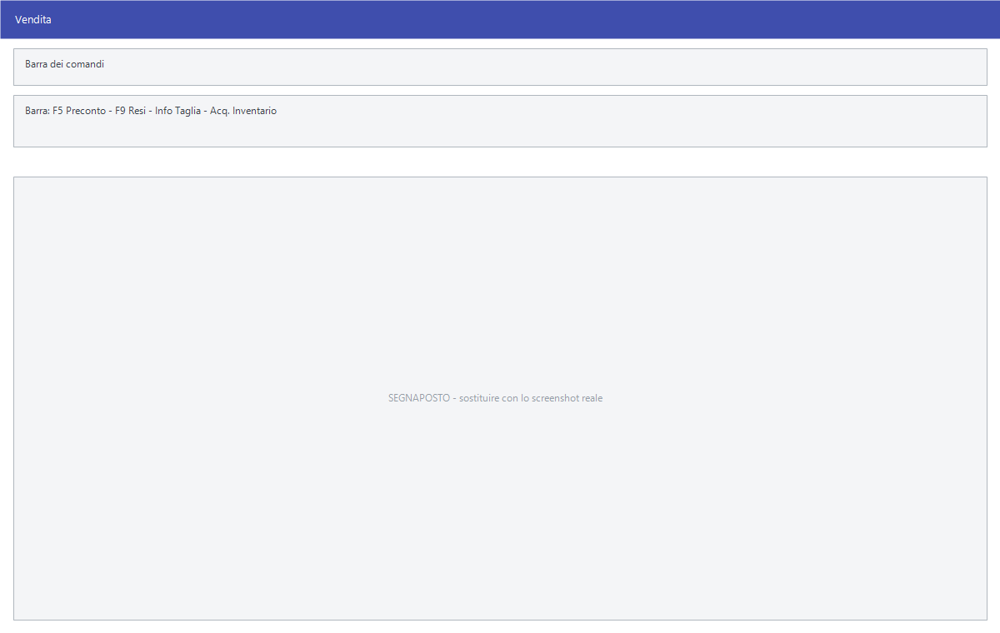

# Vendita al banco e POS

Le due schermate con cui si vende al cliente che è davanti: **Vendita** si usa
da tastiera, **Pos Touchscreen** con lo schermo tattile. Non producono un
documento differito ma battono lo scontrino e scaricano il magazzino subito.

!!! info "In sintesi"

    **Percorso:** Menu ▸ Vendite ▸ Vendita
    Menu ▸ Vendite ▸ Pos Touchscreen
    **Scorciatoia:** ++f5++ preconto, ++f9++ resi
    **Permessi richiesti:** nessun profilo predefinito; le singole voci di menu si abilitano per ogni utente da [Archivi ▸ Utenti](../anagrafiche/utenti.md); sull'utente pesano anche **Disabilita Stampe (POS)**, **Disabilita Rapporti e Azzeramenti Cassa (POS)** e **Disabilita Stampa Preconti**

---

## A cosa serve

È la cassa del negozio. Si passano gli articoli, si incassa e si chiude lo
scontrino; il magazzino si aggiorna nello stesso momento.

La differenza fra le due voci è l'interfaccia: **Vendita** è pensata per la
tastiera e il lettore di codici a barre, **Pos Touchscreen** per lo schermo
tattile con i tasti dei reparti e degli articoli.

## Prerequisiti

Prima di usare queste schermate occorre:

- avere gli [articoli](../anagrafiche/anagrafica-articoli.md) con i
  [listini](../listini-vendita/gestione-listini.md) e i codici a barre;
- avere i [reparti](../magazzino/reparti.md) collegati al registratore di
  cassa;
- avere l'[operatore](../altre-tabelle/operatori.md) registrato e collegato
  all'[utente](../anagrafiche/utenti.md);
- avere il registratore di cassa configurato.

## La maschera

Sono schermate a tutto schermo, costruite per essere usate senza mouse: la riga
dell'articolo in corso, l'elenco di quello che si sta vendendo e i totali.

<!-- DA VERIFICARE: la struttura esatta delle due schermate. Sono costruite a runtime e le etichette non stanno nelle risorse, quindi vanno descritte guardandole a video. -->

## Campi

<!-- DA VERIFICARE: i campi delle due schermate di vendita. -->

Non applicabile: si lavora passando gli articoli, non compilando campi.

## Pulsanti e comandi

| Comando | Scorciatoia | Effetto |
|---|---|---|
| **F5 - Preconto** | ++f5++ | Stampa il preconto, cioè il riepilogo non fiscale da mostrare al cliente prima di chiudere. |
| **F9 - Resi** | ++f9++ | Registra un reso. |
| **Info Taglia** | | Mostra la disponibilità per taglia e colore. |
| **Acq. Inventario** | | Acquisisce le letture per l'inventario. |
| **Esci** | | Chiude la schermata di vendita. |

## Come si fa

### Battere una vendita

1. Apri **Menu ▸ Vendite ▸ Vendita**.
2. Passa gli articoli con il lettore, o digitane il codice.
3. Se il cliente chiede il conto prima di pagare, premi **F5 - Preconto**.
4. Chiudi lo scontrino e incassa.

### Registrare un reso

1. Nella schermata di vendita premi **F9 - Resi**.
2. Indica l'articolo reso e la quantità.

## Controlli e messaggi

<!-- DA VERIFICARE: i messaggi delle due schermate di vendita. -->

Non applicabile.

## Note

!!! note "Cosa può fare l'operatore lo decide l'utente"

    Tre caselle della maschera [Utenti](../anagrafiche/utenti.md) intervengono
    qui: **Disabilita Stampe (POS)**, **Disabilita Rapporti e Azzeramenti Cassa
    (POS)** e **Disabilita Stampa Preconti**. Se un comando non risponde, è lì
    che va guardato.

!!! warning "Gli scontrini si consultano altrove"

    Da questa schermata si vende soltanto. Il riepilogo di quello che è stato
    battuto sta in [Scontrini](scontrini.md).

<!-- DA VERIFICARE: che differenza c'è, nei dati registrati, fra la vendita da tastiera e quella da POS touchscreen. -->

<!-- DA VERIFICARE: come si associa un cliente allo scontrino, per la raccolta punti. -->

## Vedi anche

- [Scontrini](scontrini.md)
- [Promozioni](promozioni.md)
- [Anagrafica articoli](../anagrafiche/anagrafica-articoli.md)
