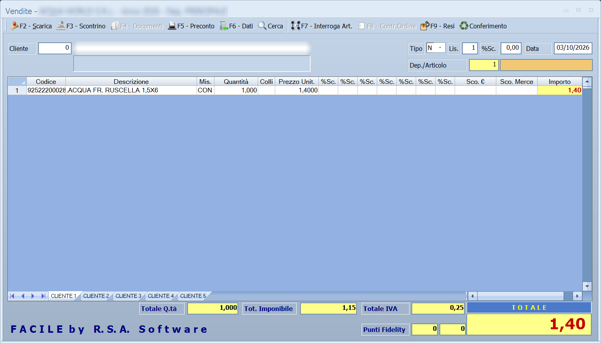
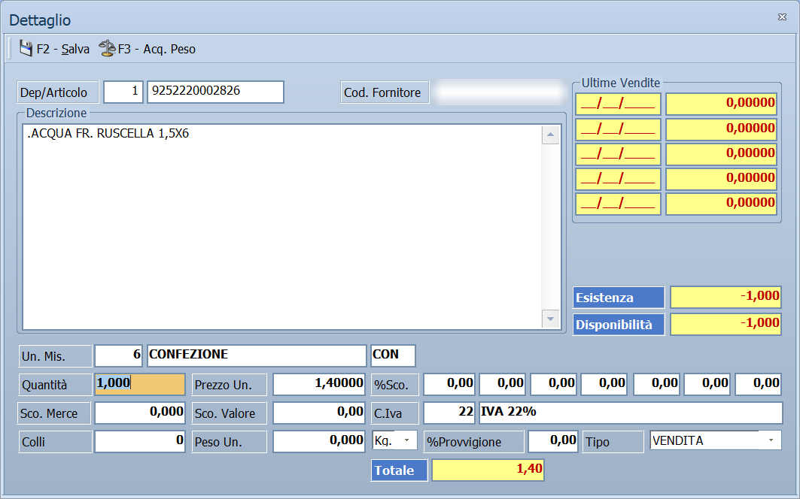
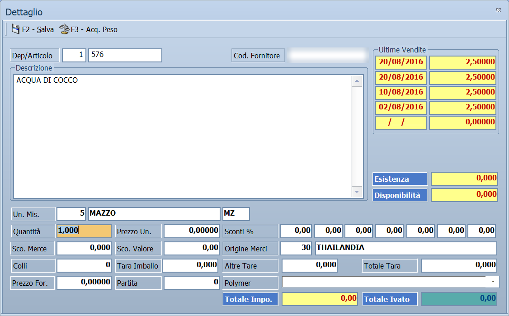
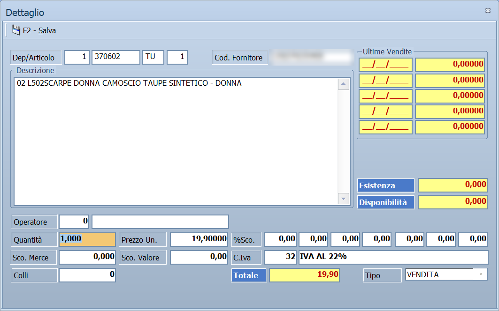
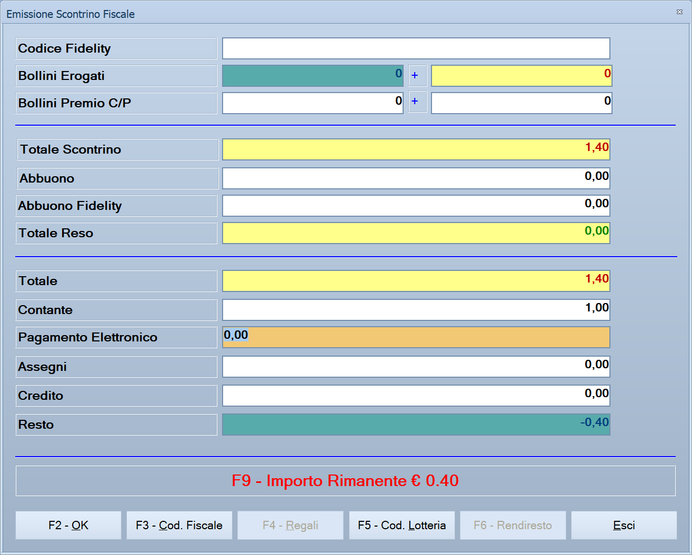
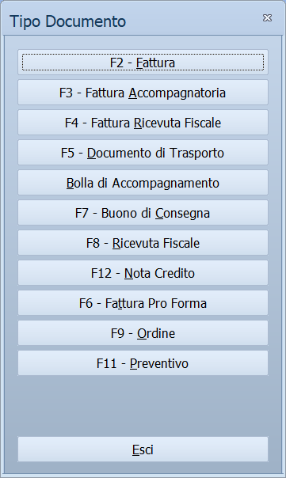
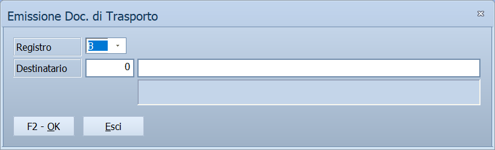
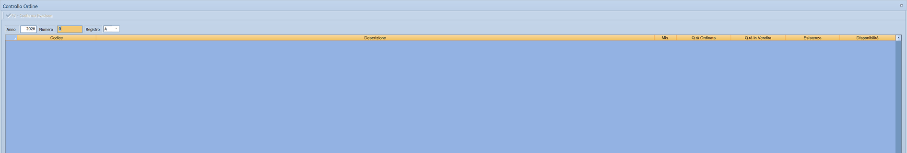
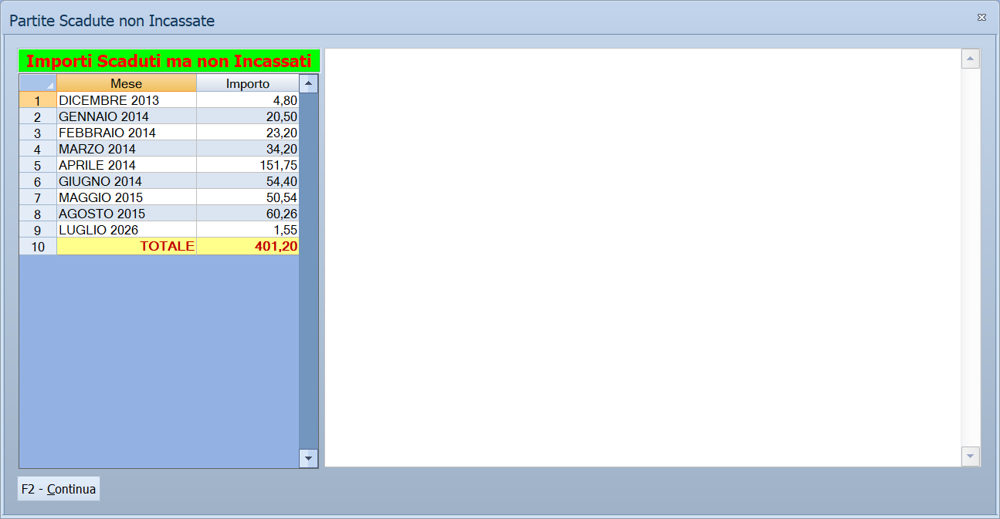
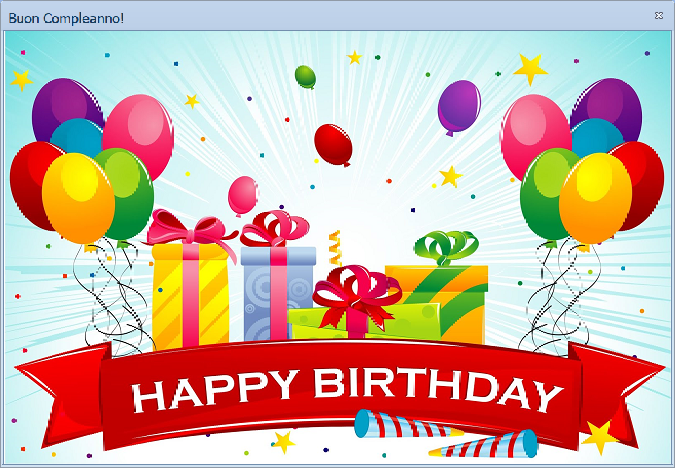

# Vendita al banco e POS

Le due schermate con cui si vende al cliente che è davanti: **Vendita** si usa
da tastiera, **Pos Touchscreen** con lo schermo tattile. Non producono un
documento differito ma battono lo scontrino e scaricano il magazzino subito.

!!! info "In sintesi"

    - **Percorso:**
        - Menu ▸ Vendite ▸ Vendita
        - Menu ▸ Vendite ▸ Pos Touchscreen
    - **Scorciatoia:** ++f2++ scarica, ++f3++ scontrino, ++f4++ documenti, ++f5++ preconto, ++f6++ dati, ++f9++ resi
    - **Permessi richiesti:** nessun profilo predefinito; le singole voci di menu si abilitano per ogni utente da [Archivi ▸ Utenti](../anagrafiche/utenti.md); sull'utente pesano anche **Disabilita Stampe (POS)**, **Disabilita Rapporti e Azzeramenti Cassa (POS)** e **Disabilita Stampa Preconti**

---

## A cosa serve

È la cassa del negozio. Si passano gli articoli, si incassa e si chiude lo
scontrino; il magazzino si aggiorna nello stesso momento.

La differenza fra le due voci è l'interfaccia: **Vendita** è pensata per la
tastiera e il lettore di codici a barre, **Pos Touchscreen** per lo schermo
tattile con i tasti dei reparti e degli articoli.

**Vendita** però non è solo una cassa: quello che si è messo sul banco può
uscire come scontrino, come semplice scarico di magazzino oppure come
documento — fattura, DDT, ordine, preventivo. È la schermata da cui si lavora
in un negozio che vende sia al banco sia a clienti con partita IVA.

## Prerequisiti

Prima di usare queste schermate occorre:

- avere gli [articoli](../anagrafiche/anagrafica-articoli.md) con i
  [listini](../listini-vendita/gestione-listini.md) e i codici a barre;
- avere i [reparti](../magazzino/reparti.md) collegati al registratore di
  cassa;
- avere l'[operatore](../altre-tabelle/operatori.md) registrato e collegato
  all'[utente](../anagrafiche/utenti.md);
- avere il registratore di cassa configurato.

## La maschera

Sono due schermate a tutto schermo, costruite per essere usate senza mouse.

**Vendita** ha tre fasce:

- in alto la **testata**: il **Cliente** con la sua ragione sociale e il suo
  indirizzo, e a destra **Tipo** di vendita, **Lis.**, **%Sc.** e **Data**;
  sotto, il campo **Dep./Articolo** da cui si passano gli articoli, e la
  scritta **RESI ATTIVO** quando si sta lavorando in modalità reso;
- al centro la **griglia** di quello che si sta vendendo;
- in basso i totali — **Totale Q.tà**, **Tot. Imponibile**, **Totale IVA** e
  il **TOTALE** in grande — e, accanto, i **Punti Fidelity**: due riquadri,
  quelli maturati adesso e quelli che il cliente aveva già.

**Pos Touchscreen** è una tastiera a video:

- a sinistra in alto una griglia di **venti tasti articolo** (quattro colonne
  per cinque righe) con le frecce per scorrere le pagine;
- sotto, **dodici tasti reparto** (quattro per tre), anch'essi scorribili;
- in basso le **funzioni**: *Reso*, *Correz.*, *Solo Scarico*, *Prezzo
  Libero*, *Info Prezzo*, *Apre Casset.*, *Operat.*, *Doc.*, *Funzioni*,
  *Memo*, *Varianti*, *Stampa*, *Vincita*, *Annulla Scontr.*, *Storno*, *Pre
  Conto*, *Premio*, *Cliente*, *Cod. Fiscale*, *Lotteria* ed *Esci*;
- a destra il **display a due righe**, il **TOTALE** e la griglia dello
  scontrino in corso, con sotto il **tastierino numerico**.

Alcuni tasti cambiano nome secondo la configurazione: *Funzioni* può diventare
*Note*, *Stampa* può diventare *Agg.Cli.*, e così via.

## Campi

Nel **Pos Touchscreen** non ci sono campi: si preme e basta. In **Vendita**
la testata ne ha alcuni.

| Campo | Obbl. | Descrizione | Valori ammessi |
|---|:---:|---|---|
| **Cliente** | | Il [cliente](../anagrafiche/anagrafica-clienti.md) a cui si sta vendendo. Accanto compaiono ragione sociale e indirizzo. Lasciandolo vuoto la vendita è anonima. | codice |
| **Tipo** | | Il tipo di vendita, che decide il listino e la provvigione. | `N` normale, `T` trasferta, `C` e `D` centro servizi |
| **Lis.** | | Il [listino](../listini-vendita/gestione-listini.md) da applicare. Proposto dal cliente. | codice |
| **%Sc.** | | Lo sconto generale. Proposto dal cliente. | percentuale |
| **Data** | | La data della vendita. | data |
| **Dep./Articolo** | | Il deposito e il codice dell'articolo da aggiungere. È il campo su cui si legge il codice a barre. | codici |
| **Totale Q.tà**, **Tot. Imponibile**, **Totale IVA**, **TOTALE** | | I totali di quello che è sul banco. | Sola lettura |
| **Punti Fidelity** | | A sinistra i punti che questa vendita fa maturare, a destra quelli già in saldo sulla tessera del cliente. | Sola lettura |

### La riga

Il doppio clic su una riga della griglia apre **Dettaglio**, la scheda
completa della riga. Se nella [ditta](../anagrafiche/ditte.md) **Conferma
Dati** è `SI`, la finestra si apre anche da sola ogni volta che passi un
articolo.

| Campo | Descrizione |
|---|---|
| **Dep/Articolo**, **Cod. Fornitore** | Il deposito, l'articolo e il suo codice presso il fornitore. Si leggono soltanto. |
| **Descrizione** | Proposta dall'articolo; si corregge e si allunga su più righe. |
| **Ultime Vendite** | Le ultime cinque vendite dell'articolo a questo cliente, con data e prezzo. Senza cliente, le ultime vendite dell'articolo. |
| **Esistenza**, **Disponibilità** | Quanti pezzi ci sono in magazzino, e quanti ne restano tolti gli ordini dei clienti e gli impegni. |
| **Un. Mis.** | L'[unità di misura](../magazzino/unita-di-misura.md). |
| **Coef. Mol** | I due coefficienti che moltiplicano la quantità. Compaiono solo con l'impostazione **Usa Coefficenti Moltiplicativi** della ditta. |
| **Quantità**, **Prezzo Un.** | Quanto e a che prezzo. |
| **%Sco.** | Fino a sette sconti in cascata. |
| **Sco. Merce**, **Sco. Valore** | La quantità data in sconto merce e uno sconto in euro. |
| **C.Iva** | L'[aliquota IVA](../contabilita/aliquote-iva.md) della riga. Obbligatoria. |
| **Colli**, **Peso Un.** | I colli e il peso di un pezzo, con la sua unità. |
| **%Provvigione** | La provvigione dell'agente. |
| **Tipo** | `VENDITA` o `SOSTITUZIONE`. |
| **Totale**, **Totale Ivato** | Il totale della riga, senza e con l'IVA. **Totale Ivato** non c'è quando la ditta lavora a prezzi IVA compresa. |
| **Lotto**, **SSCC**, **GTIN**, **Scadenza** | I dati del lotto. Compaiono solo per gli articoli a lotti, e solo con **Usa Gestione Lotti** acceso nella ditta. |

Con **Blocca imputazione prezzi maschere vendita** acceso nella ditta, chi non
è amministratore non può cambiare prezzo, sconti e provvigione.

La barra ha **F2 - Salva**, che registra la riga e torna al banco, e
**F3 - Acq. Peso**, che legge il peso dalla bilancia e lo scrive in
**Quantità**: c'è solo se nelle [impostazioni della
postazione](../utility/impostazioni-postazione.md) è indicata la **Bilancia
Checkout**. Senza descrizione o senza aliquota IVA la riga non si salva: il
cursore va sul campo da completare.

**Solo Ortofrutta.** La riga del banco è fatta per la merce venduta a peso e
in casse:

| Campo | Descrizione |
|---|---|
| **Sconti %** | Fino a sette sconti in cascata. |
| **Origine Merci** | L'origine della merce, dalla tabella delle origini. |
| **Colli**, **Tara Imballo**, **Altre Tare** | I colli, la tara di un collo e le altre tare della riga. |
| **Totale Tara** | **Altre Tare** più **Colli** per **Tara Imballo**. Lo calcola il programma; l'importo della riga si calcola sulla quantità meno la tara. |
| **Prezzo For.** | Il prezzo di acquisto dal fornitore. |
| **Partita** | Il numero del carico da cui viene la merce. Indicandolo, origine e imballo si prendono dal carico. |
| **Polymer** | L'imballo: l'elenco propone gli articoli del sottogruppo `IMBALLO`, più `SENZA IMBALLO`. |
| **Totale Impo.**, **Totale Ivato** | Il totale della riga, senza e con l'IVA. |

Non ci sono **Peso Un.**, **%Provvigione** e **Tipo**. La partita è
obbligatoria: senza, la riga chiede di forzare. Con **Disabilita Richiesta
Partita** acceso nella ditta non viene chiesta, e **Prezzo For.**, **Partita** e
**Polymer** non compaiono.

**Solo Taglie e Colori.** Passando un articolo si apre *Seleziona Taglia e
Colore*, che chiede la taglia del gruppo e il colore. Nella riga taglia e
colore stanno accanto al codice dell'articolo, e non ci sono **Peso Un.**,
**%Provvigione**, **Prezzo For.**, **Tara** e **Partita**. Nella variante
**Calzature** al posto dell'unità di misura c'è l'**Operatore**, e gli ultimi
due sconti non si scrivono.

Sui campi funzionano anche questi tasti:

| Tasto | Dove | Effetto |
|---|---|---|
| ++f4++ | ovunque | Apre i listini dell'articolo e prende prezzo, sconti e provvigione da quello scelto. Non funziona con i prezzi bloccati. |
| ++space++ | **Prezzo Un.** | Come ++f4++. |
| ++f6++ | **Prezzo Un.** | Toglie l'IVA dal prezzo. |
| ++f9++ | **Prezzo Un.** | Divide il prezzo per la quantità: si scrive l'importo della riga e si ottiene il prezzo unitario. |
| ++f9++ | **Quantità** | Moltiplica la quantità per i pezzi della confezione: si scrivono i colli e si ottengono i pezzi. |
| ++f10++ | **Quantità** | Arrotonda la quantità alle confezioni intere. |
| ++f10++ | **Prezzo Un.** | Aggiunge l'IVA al prezzo se l'articolo è a prezzo IVA compresa, la toglie se non lo è. |
| ++f10++ | **Descrizione** | Inserisce, dove si trova il cursore, una delle descrizioni predefinite. |
| ++f10++ o ++space++ | **Un. Mis.**, **C.Iva**, **Lotto** | Apre l'elenco da cui scegliere. |

### La chiusura dello scontrino

**F3 - Scontrino** apre *Emissione Scontrino Fiscale*: qui si dice come paga
il cliente e quanti punti fedeltà muove lo scontrino; **F2 - OK** lo manda
alla cassa.

| Campo | Descrizione |
|---|---|
| **Codice Fidelity** | La tessera fedeltà. È proposta quella del cliente indicato sul banco. |
| **Bollini Erogati** | A sinistra i punti che lo scontrino fa maturare, a destra quelli già sulla tessera. Il giorno del compleanno del cliente i punti si moltiplicano o si sommano come stabilito nella ditta con **Bollini Giorno Compleanno**. |
| **Bollini Premio C/P** | I punti da scalare dalla tessera per un premio: il primo riquadro li toglie dai punti della campagna attuale, il secondo da quelli della campagna precedente. |
| **Totale Scontrino** | Il totale del banco. |
| **Abbuono** | Uno sconto sul totale, in euro. |
| **Abbuono Fidelity** | Lo sconto che vale il premio: i punti di **Bollini Premio C/P** per il **Valore Bollino** della ditta. Lo calcola il programma. |
| **Totale Reso** | L'importo di un reso appena fatto, se si decide di usarlo per pagare. |
| **Totale** | Quello che il cliente deve pagare. |
| **Contante**, **Pagamento Elettronico**, **Assegni**, **Credito** | Come paga. Il **Credito** si può usare solo con un cliente indicato e con la causale **Registraz. Crediti** impostata nella ditta. |
| **Resto** | Il resto da dare. Lo calcola il programma. |

**Solo Taglie e Colori - Calzature.** Con la fidelity della variante la riga
si chiama **Bollini Premio** e ha un riquadro solo, e **Pagamento
Elettronico**, **Assegni** e **Credito** non si compilano.

Quando i pagamenti non coprono il totale, in fondo compare in rosso
**F9 - Importo Rimanente** con la cifra che manca: ++f9++ sul campo di un
pagamento lo riempie con quella cifra.

| Pulsante | Scorciatoia | Effetto |
|---|---|---|
| **F2 - OK** | ++f2++ | Emette lo scontrino. Con un **Pagamento Elettronico** chiede prima con che cosa si paga; con un cliente indicato e **Fatture da Scontrino su Vendita** acceso nella postazione, chiede se emettere lo scontrino o la fattura. |
| **F3 - Cod. Fiscale** | ++f3++ | Il codice fiscale, o la partita IVA, da stampare sullo scontrino. È proposto quello del cliente. |
| **F4 - Regali** | ++f4++ | Si accende dopo l'emissione: stampa i buoni regalo dello scontrino appena fatto. |
| **F5 - Cod. Lotteria** | ++f5++ | Il codice lotteria del cliente. Codice fiscale e codice lotteria si escludono: indicandone uno, l'altro si toglie. |
| **F6 - Rendiresto** | ++f6++ | Incassa con la cassa automatica: vedi [più avanti](vendita-al-banco.md#incassare-con-la-cassa-automatica-pagamico). |
| **Esci** | ++esc++ | Torna al banco senza emettere niente. |

### La scelta del documento

**F4 - Documenti** apre *Tipo Documento*, un pulsante per ogni documento che
si può emettere con quello che c'è sul banco: **F2 - Fattura**, **F3 -
Fattura Accompagnatoria**, **F4 - Fattura Ricevuta Fiscale**, **F5 -
Documento di Trasporto**, **Bolla di Accompagnamento**, **F7 - Buono di
Consegna**, **F8 - Ricevuta Fiscale**, **F12 - Nota Credito**, **F6 - Fattura
Pro Forma**, **F9 - Ordine** e **F11 - Preventivo**.

Scelto il documento, una seconda finestra — *Emissione Fattura*, *Emissione
Doc. di Trasporto* e così via — chiede gli ultimi dati:

| Campo | Descrizione |
|---|---|
| **Registro** | Il registro del documento. È proposto quello dell'utente, se ne ha uno, altrimenti quello del tipo di documento impostato nella ditta. Con il registro unico nella ditta non si cambia, salvo che per fatture, fatture accompagnatorie e pro forma. |
| **Prezzi Iva Inclusa** | Solo su preventivi e buoni di consegna, quando la ditta non lavora già a prezzi IVA compresa. |
| **N. Scontrino** | Solo sul buono di consegna: lo scontrino a cui si riferisce. |
| **Destinatario** | La [destinazione](../anagrafiche/destinazioni-diverse.md) della merce, con il suo indirizzo sotto. Non c'è su fattura, ricevuta fiscale e pro forma. |

**F2 - OK** emette il documento, **Esci** torna al banco.

Emesso il documento, il foglio del banco si svuota subito e il documento si
apre nella maschera del [documento di vendita](documento-di-vendita.md), per
la stampa e gli ultimi ritocchi; il DDT, alla chiusura, chiede il piede. Il
banco è già libero per la vendita successiva, anche mentre il documento o il
suo piede sono ancora aperti.

### Il controllo con un ordine

**F8 - Contr.Ordine** apre *Controllo Ordine*: si indicano **Anno**,
**Numero** e **Registro** di un ordine del cliente e la griglia mette a
confronto, articolo per articolo, la **Q.tà Ordinata** ancora da evadere con
la **Q.tà in Vendita** sul banco, accanto a **Esistenza** e
**Disponibilità**.

Le righe che non tornano sono in grassetto, e in alto due scritte le contano:
in rosso *Rilevati … errori !*, gli articoli venduti in più di quanto ordinato
o non ordinati affatto; in blu *Rilevate … difformità !*, gli articoli
ordinati e non venduti, o venduti in meno.

**F2 - Conferma Evasione** segna come evase sull'ordine le quantità vendute e
apre subito la [scelta del documento](#la-scelta-del-documento). Si accende
solo se almeno un articolo è sia sull'ordine sia sul banco. L'ordine evaso è
quello caricato in griglia: se cambi il numero, esci dal campo per caricare
il nuovo ordine prima di confermare.

### Le partite scadute

Con **Controlla Scadenze** a `SI` nella ditta, indicando il cliente si apre
*Partite Scadute non Incassate*: a sinistra le scadenze passate e non ancora
pagate, sommate mese per mese con il **TOTALE** in fondo; a destra le note
del cliente. Se il cliente non ha né scadenze aperte né note, la finestra non
compare.

**F2 - Continua** chiude la finestra. La stessa finestra torna quando si preme
**F4 - Documenti**, salvo che per ordini e preventivi: lì ha anche **Esci**,
che rinuncia al documento.

### Il compleanno del cliente

Se il giorno e il mese della **Data di Nascita** del cliente — nella scheda
*Fidelity* dell'[anagrafica](../anagrafiche/anagrafica-clienti.md) — sono
quelli di oggi, indicando il cliente si apre *Buon Compleanno!* con
un'immagine di auguri e un motivo musicale. La finestra si chiude da sola
dopo trenta secondi, o con un doppio clic.

L'immagine e la musica sono due file nella cartella dei modelli di Facile,
`birthday.bmp` e `birthday.wav`: si possono sostituire con altri dello stesso
nome. Senza l'immagine la finestra mostra la scritta **Happy Birthday**.

## Pulsanti e comandi

Questi sono i comandi della schermata **Vendita**.

| Comando | Scorciatoia | Effetto |
|---|---|---|
| **F2 - Scarica** | ++f2++ | Scarica gli articoli dal magazzino **senza emettere niente**. |
| **F3 - Scontrino** | ++f3++ | Scarica gli articoli **e batte lo scontrino fiscale**. Resta spento se il registratore di cassa non è configurato. |
| **F4 - Documenti** | ++f4++ | Emette un documento con gli articoli sul banco: fattura, DDT, ordine, preventivo e gli altri. |
| **F5 - Preconto** | ++f5++ | Stampa il preconto, cioè il riepilogo non fiscale da mostrare al cliente prima di chiudere. |
| **F6 - Dati** | ++f6++ | Prende gli articoli da un **ordine**, da un **preventivo**, da un **DDT conto vendita** o da un lettore di codici a barre. |
| **F7 - Interroga Art.** | ++f7++ | Interrogazione dell'articolo. |
| **F8 - Contr.Ordine** | ++f8++ | Confronta quello che è sul banco con un ordine e segnala le differenze. |
| **F9 - Resi** | ++f9++ | Registra un reso: vedi [Registrare un reso](vendita-al-banco.md#registrare-un-reso). Premuto di nuovo, torna alla vendita normale. |
| **Cerca** | | Cerca un articolo. |
| **Info Taglia** | | Mostra la disponibilità per taglia e colore. |
| **Acq. Inventario** | | Acquisisce le letture per l'inventario. |
| **Buoni Regalo** | | Gestisce i buoni regalo. |
| Doppio clic su una riga | | Apre la [riga](#la-riga). |
| **Esci** | | Chiude la schermata di vendita. |

## Come si fa

### Battere una vendita

1. Apri **Menu ▸ Vendite ▸ Vendita**.
2. Passa gli articoli con il lettore, o digitane il codice.
3. Se il cliente chiede il conto prima di pagare, premi **F5 - Preconto**.
4. Chiudi lo scontrino e incassa.

### Passare in cassa lo scontrino di una bilancia

Vale per il **Pos Touchscreen** e per le bilance che lasciano lo scontrino in
un file: Zenith, Bizerba, Macchi e Dibal. Lo scontrino della bilancia porta in
fondo un codice a barre. Per le Zenith il file e il codice a barre seguono il
[tracciato standard di Facile](../casse-bilance/bilance.md#il-tracciato-standard-degli-scontrini-zenith),
che va impostato in Zenith System.

1. Apri **Menu ▸ Vendite ▸ Pos Touchscreen**.
2. Leggi con il lettore il codice a barre in fondo allo scontrino della
   bilancia.
3. Le righe dello scontrino entrano sul banco, ciascuna con il peso o i pezzi
   e il prezzo della bilancia. Se sulla bilancia una riga era stata scontata,
   sotto l'articolo compare la riga **SCONTO VAL.** con lo stesso sconto, e il
   totale torna uguale a quello stampato dalla bilancia.
4. Se qualche riga non si è potuta inserire, la cassa la elenca in un
   avviso: aggiungila a mano prima di chiudere.
5. Chiudi lo scontrino e incassa.

Uno scontrino della bilancia si passa una volta sola: per le Zenith, se lo
rileggi, la cassa avvisa che è già stato letto.

Ogni riga si riconosce da **Bancone** e **Num. PLU** dell'articolo, nella
scheda *Impostazioni* dell'[anagrafica articoli](../anagrafiche/anagrafica-articoli.md).
Sulle Zenith le vendite battute sulla bilancia senza tasto articolo arrivano
con PLU 0: perché entrino anche loro serve un articolo — per esempio «VARIE
BILANCIA» — con lo stesso **Bancone** e **Num. PLU** 0, e deve essere l'unico
con quella coppia. Su questo articolo lascia spenta **Gestione Bilancia**, così
non viene mandato alle bilance.

### Registrare un reso

1. Con il banco vuoto premi **F9 - Resi**: in alto compare la scritta
   **RESI ATTIVO** e si apre *Inserisci Codice Scontrino*.
2. Leggi con il lettore il codice a barre stampato sullo scontrino da
   rendere, o scrivilo, e premi **F2 - OK**. Vale per gli scontrini
   dell'anno in corso e di quello precedente.
3. Si apre lo scontrino. Con il doppio clic segna le righe che il cliente
   restituisce e premi **F2 - OK**.
4. Le righe passano sul banco come reso, con il cliente dello scontrino.
   Chiudi come una vendita normale.

Se lo scontrino non c'è, con **Esci** sulla richiesta del codice si resta in
modalità reso e gli articoli si passano a mano.

### Far maturare i punti al cliente

1. Prima di passare gli articoli, scrivi il codice del cliente nel campo
   **Cliente** in alto a sinistra — o cercalo con l'elenco.
2. Vendi normalmente: in basso a destra, accanto a **Punti Fidelity**, il
   primo riquadro conta i punti che la vendita sta facendo maturare e il
   secondo mostra quelli già sulla tessera.
3. Chiudi con **F3 - Scontrino**: i punti restano legati allo scontrino e al
   cliente.

Sul **Pos Touchscreen** lo stesso si fa con il tasto **Cliente**.

### Parcheggiare uno scontrino e riprenderlo dopo

Sul **Pos Touchscreen** uno scontrino a metà si può mettere da parte, servire
un altro cliente e riprenderlo più tardi. Lo fa un tasto solo, che cambia nome:
**Memo** quando nello scontrino ci sono righe, **Rich.** quando è vuoto.

1. Con lo scontrino aperto premi **Memo**: si apre *Parcheggia Scontrino*, con
   ventiquattro posti numerati. Quelli già occupati mostrano il cliente, o il
   numero del posto, con data e ora, e non si possono scegliere.
2. Premi un posto libero: lo scontrino vi viene salvato e la schermata si
   svuota, pronta per il cliente successivo.
3. Quando vuoi riprenderlo, a scontrino vuoto premi **Rich.**: si apre
   *Richiama Scontrino* e si possono scegliere solo i posti occupati.
4. Premi il posto: tornano le righe e i dati del cliente — sconto, listino,
   punti, codice fiscale, lotteria — e il posto si libera.

Lo scontrino ripreso si lavora come uno appena battuto. Se con **Correz.** ne
togli tutte le righe, la schermata riparte da capo — cliente compreso — e il
tasto torna **Rich.**, pronto per richiamarne un altro.

A decidere è lo scontrino, non la scritta: a scontrino vuoto il tasto richiama
sempre, anche nel breve momento in cui porta ancora scritto **Memo** — per
esempio dopo aver battuto un codice che non è in archivio.

!!! note "I posti sono gli stessi per tutte le casse"

    I ventiquattro posti sono in comune fra tutte le postazioni: uno scontrino
    parcheggiato a una cassa si può riprendere da un'altra.

### Fatturare quello che è sul banco

1. Passa gli articoli come per una vendita normale.
2. Premi **F4 - Documenti** invece di **F3 - Scontrino**.
3. Scegli che documento emettere: fattura, fattura accompagnatoria, DDT,
   bolla, buono di consegna, ricevuta fiscale, ordine, preventivo, nota di
   credito o pro forma.
4. Il documento nasce già con le righe del banco e si completa come un
   [documento di vendita](documento-di-vendita.md) qualsiasi.

!!! note "Le righe del conto vendita vanno solo in fattura"

    Le righe prese da un **DDT conto vendita** non scaricano il magazzino, perché
    la merce è uscita con il DDT. Per questo si possono emettere solo in
    fattura, fattura accompagnatoria, ricevuta fiscale o pro forma: scegliendo
    un altro documento il programma si ferma e lo dice.

!!! note "Ogni foglio tiene i suoi documenti richiamati"

    Il banco tiene aperte fino a cinque vendite, una per foglio. Quello che si
    prende con **F6 - Dati** da un ordine, un preventivo o un DDT — il numero
    del documento d'origine, la sua data, il pagamento, il destinatario,
    l'agente — resta legato al foglio su cui è stato preso: passando da un
    foglio all'altro, ognuno ritrova i suoi. Se sul foglio cambi il cliente,
    quei riferimenti si tolgono e il programma lo dice.

### Incassare con la cassa automatica PagAmico

Con la cassa automatica **PAGAMICO**, scelta nelle [impostazioni della
postazione](../utility/impostazioni-postazione.md), il contante lo prende la
macchina e il resto lo rende lei. Facile non parla direttamente con la
macchina: passa dal FacileWebApiService, che deve essere in esecuzione.

1. Batti lo scontrino come al solito.
2. Sul **Pos Touchscreen** premi il tasto **PagAmico**; nella chiusura dello
   scontrino di **Vendita** premi **F6 - Rendiresto**.
3. Si apre la finestra **Cassa Automatica** con *Inserire Euro … nella cassa*:
   il cliente inserisce banconote e monete, e la finestra mostra quanto ha già
   inserito.
4. Quando l'importo è coperto la macchina rende il resto, la finestra si chiude
   e lo scontrino si chiude con il contante incassato.

Per fermare un incasso premi **Esci** nella finestra. Se il cliente non ha
ancora inserito niente l'incasso si chiude; altrimenti il programma chiede se
restituire il denaro (**Sì**), trattenerlo come pagamento parziale (**No**: lo
scontrino resta aperto per la parte che manca) o continuare (**Annulla**).

Se dopo la richiesta di chiusura la finestra resta aperta — la macchina non l'ha
ancora eseguita, o l'ha rifiutata — premi di nuovo **Esci**: puoi ripetere la
richiesta (**Sì**), continuare ad aspettare (**No**) o smettere di aspettare
(**Annulla**). Smettendo di aspettare l'esito resta sconosciuto: guarda il
display della macchina prima di ripetere l'incasso.

Se la macchina non ha i tagli per rendere tutto il resto, lo dice e indica la
cifra da dare a mano: lo scontrino la riporta come resto. Dopo ogni incasso, e
all'apertura della schermata, il programma avvisa anche quando la macchina ha
troppe monete, un taglio esaurito o il cassetto di recupero pieno.

!!! warning "Un incasso dall'esito incerto non si ripete alla cieca"

    Se il collegamento con il servizio si interrompe mentre il cliente sta
    pagando, il denaro può essere già dentro la macchina. Prima di ripetere
    l'incasso guarda il display della cassa automatica: se l'incasso è ancora
    aperto, chiudilo con **Chiudi Incasso Sospeso** (vedi sotto).

### Gestire la cassa PagAmico

Dal **Pos Touchscreen**, **Funzioni ▸ Cassa Automatica** apre la finestra
**PagAmico**:

| Pulsante | Effetto |
|---|---|
| **Mostra Livelli** | Mostra quante monete e banconote di ogni taglio ci sono nella macchina, e avvisa se qualcosa è sotto scorta, esaurito o troppo pieno. |
| **Preleva Contante** | Chiede un importo e lo fa erogare dalla macchina. |
| **Chiudi Incasso Sospeso** | Chiude un incasso rimasto aperto sulla macchina, per esempio dopo che Facile è stato chiuso a metà: **Sì** restituisce al cliente il denaro inserito, **No** lo trattiene nella cassa. |
| **Ricarica Fondo Cassa** | Apre la ricarica del fondo cassa: si inseriscono monete e banconote, la finestra mostra quanto è stato caricato, **Annulla** la chiude. Vedi [Ricaricare il fondo cassa](../casse-bilance/casse-automatiche/pagamico.md#ricaricare-il-fondo-cassa). |
| **Esci** | Chiude la finestra. |

## Controlli e messaggi

Sono molti, e quasi tutti si capiscono meglio sapendo **in che momento**
arrivano. Qui sono raccolti per quello, non in ordine alfabetico.

### Quando si apre la schermata

| Messaggio | Causa | Cosa fare |
|---|---|---|
| *Attenzione!  Non e' stato impostato il listino di vendita. Saranno riportati per la vendita i prezzi di acquisto.* | La [ditta](../anagrafiche/ditte.md) non ha un listino di vendita. | Impostalo: altrimenti si vende al prezzo di acquisto. Il messaggio compare all'apertura della schermata. |
| *Attenzione!  Non e' stato impostato il listino di vendita per i trasfert. Saranno riportati per la vendita i prezzi di acquisto.* | Come sopra, per le vendite in trasferta. | Impostalo nella ditta. |
| *Impostazioni modello cassa o porta COM non valide! Per impostare il modello di cassa e la porta COM andare su Utility->Impostazioni Postazione. Vuoi entrare in modalita' DEMO ?* | La postazione non sa a quale registratore di cassa parlare. | **No** e si sistemano le [impostazioni della postazione](../utility/impostazioni-postazione.md). **Sì** apre la schermata in prova: si lavora, ma **non esce nessuno scontrino fiscale**. |
| *Matricola stampante fiscale non impostata!* / *Matricola stampante fiscale non valida!* | Manca o è sbagliata la matricola del registratore telematico. | Si imposta nelle impostazioni della postazione. |
| *Numero cassa non valido!* | La postazione non ha un numero di cassa. | Come sopra. |
| *Anno di esercizio diverso da anno emissione scontrini ! Vuoi Continuare ?* | Si sta lavorando su un esercizio diverso da quello in cui escono gli scontrini. | Quasi sempre è il segno che va aperto il nuovo esercizio. |
| *Anno corrente diverso da anno emissione scontrini! Necessaria apertura nuovo esercizio. Contattare l'assistenza tecnica.* | Lo stesso caso, ma qui il programma non lascia proseguire. | Va aperto il nuovo esercizio. |
| *Causale Vendita non impostata o non valida!* / *Causale Vendita Senza Documenti impostata o non valida!* | Mancano le [causali](../magazzino/causali-magazzino.md) con cui il banco scarica il magazzino. | Si impostano nella scheda della [ditta](../anagrafiche/ditte.md). |
| *Deposito attivo non impostato o non valido !* / *Selezionare il Deposito !* | Manca il [deposito](../magazzino/depositi.md) da cui scaricare. | Va indicato prima di vendere. |
| *Il codice dell' Operatore non è valido o disponibile.* | L'[operatore](../altre-tabelle/operatori.md) non esiste. | Va creato o corretto. |

!!! warning "La modalità DEMO non emette scontrini"

    Rispondere **Sì** alla domanda sulla modalità demo fa aprire la
    schermata anche senza cassa collegata: le righe si scrivono, i totali si
    calcolano, **ma il documento fiscale non viene emesso**. Va benissimo per
    provare o per far pratica; è un guaio se qualcuno ci lavora credendo di
    star battendo scontrini veri.

### Quando si battono le righe

| Messaggio | Causa | Cosa fare |
|---|---|---|
| *Attenzione! Articolo Inesistente Codice … Q.ta …* | Il codice letto o digitato non è in archivio. | Controllare il codice o creare l'articolo. |
| *Codice non trovato in archivio ! Vuoi effettuare un ricerca ?* | Come sopra. | **Sì** apre la ricerca articoli. |
| *Sequenza Errata* (sul display del Pos Touchscreen) | Fra le altre cause: hai battuto una quantità da moltiplicare e poi letto l'etichetta di una bilancia che porta già l'importo; oppure hai letto lo scontrino di una bilancia Zenith con il moltiplicatore, il reso, lo storno o il prezzo libero ancora attivi. | Premi **C** e rileggi l'etichetta o lo scontrino senza altri tasti; per più pezzi, leggi un'etichetta per pezzo. |
| *Attenzione! PLU non trovato in archivio (…)* | Il PLU letto dalla bilancia non corrisponde a nessun articolo. | Va allineata la [bilancia](../casse-bilance/bilance.md). |
| *Lo scontrino della bilancia n. … e' gia' stato letto!* | Lo scontrino di una bilancia Zenith è già passato in cassa. | Non va ripassato. Se le sue righe non sono sul banco, battile a mano. |
| *Lo scontrino della bilancia n. … e' stato riaperto sulla bilancia e non contiene vendite!* | Dopo averlo emesso, sulla bilancia lo scontrino è stato riaperto. | Le vendite non sono in quel file: battile a mano. <!-- DA VERIFICARE: dopo la riapertura la bilancia emette un nuovo scontrino con le stesse righe? --> |
| *Lo scontrino della bilancia n. … non e' completo!  Riprova fra qualche secondo: se il messaggio si ripete, controlla il file …* | Il file dello scontrino non ha tutte le righe che dichiara, o il loro totale non torna: di solito la bilancia lo sta ancora scrivendo. Sul banco non entra nulla. | Rileggi il codice dopo qualche secondo. Se il messaggio si ripete, fai controllare il file indicato. |
| *Impossibile aprire lo scontrino della bilancia!  …* | Il file c'è ma non si apre, per esempio perché un altro programma lo tiene aperto. | Riprova; se si ripete, controlla i permessi della cartella indicata. |
| *Attenzione!  Alcune righe dello scontrino della bilancia n. … non sono state inserite:  … Aggiungile a mano prima di chiudere lo scontrino.* | Le altre righe sono entrate. Per ogni riga saltata l'avviso indica bancone, PLU, descrizione, importo e il motivo: *PLU non trovato*, *PLU presente su piu' articoli*, *riga non accettata dalla cassa*; oppure *sconto di Euro … non applicato*, se è entrato l'articolo ma non il suo sconto. | Batti a mano quello che l'avviso elenca, poi sistema l'articolo in [anagrafica](../anagrafiche/anagrafica-articoli.md) perché la prossima volta entri da solo. |
| *Per questo Articolo non e' stato Impostato il Reparto Cassa!* | L'articolo non ha il reparto con cui la cassa lo registra. | Si imposta in [anagrafica articoli](../anagrafiche/anagrafica-articoli.md): senza, lo scontrino non si chiude. |
| *Per l' articolo regalo non e' stato Impostato il Reparto Cassa!* | Lo stesso, per l'articolo usato come omaggio. | Come sopra. |
| *Per l'articolo indicato non e' presente un prezzo di listino! Vuoi inserirlo ugualmente?* | L'articolo non ha prezzo sul listino in uso. | **Sì** lo mette a zero: va corretto a mano. |
| *Attenzione ! L'articolo selezionato risulta escluso dal listino.* | L'articolo è escluso da quel listino. | Non si vende con quel listino. |
| *Attenzione Listino di Vendita non Impostato! Per la Vendita si usera' l'Ultimo Prezzo di Acquisto!* | Manca il listino. | I prezzi proposti sono quelli di acquisto. |
| *Riga N. … Esistenza non sufficiente per effettuare la vendita!* | Non c'è giacenza. | Controllare il magazzino: può essere un carico non registrato. |
| *L'Articolo selezionato ha raggiunto il Sottoscorta !* | L'articolo è sceso sotto la scorta minima. | È un avviso, la vendita prosegue. |
| *Non sono ammesse quantità con decimali!* | L'articolo si vende a pezzi interi. | Correggere la quantità. |
| *L'articolo … con la gestione dei seriali abilitata non puo' essere venduto con quantita' decimali!* | Come sopra, per gli articoli a matricola. | Come sopra. |
| *E' necessario inserire le matricole per chiudere lo scontrino!* | Righe a matricola senza matricola indicata. | Vanno inserite prima di chiudere. |
| *Attenzione ! Gestione Lotti attiva per l'articolo selezionato. Vuoi Forzare ?* | L'articolo vuole il [lotto](../analisi-dati/analisi-lotti.md). | **No** torna a indicarlo; **Sì** vende senza, e la tracciabilità si perde. |
| *Per questo Articolo deve essere indicato il Lotto!* | Come sopra, senza possibilità di forzare. | Il lotto va indicato. |
| *Non c'è giacenza sufficiente per il lotto indicato!* | Il lotto non ha abbastanza merce. | Sceglierne un altro o dividere la riga. |
| *Riga … - Manca la taglia* / *Manca il colore* | Articolo per taglie e colori senza taglia o colore. | Vanno indicati. |
| *La Quantita' indicata e' pari a Zero ! Vuoi eliminare la riga ?* | Quantità a zero. | **Sì** toglie la riga. |
| *Raggiunto il numero massimo di sconti applicabili! Lo sconto della promozioni non e' stato applicato!* | La riga ha già tutti gli sconti che può avere. | La [promozione](promozioni.md) **non entra**: se deve valere, va tolto uno degli sconti manuali. |
| *Attenzione! Ci sono righe con prezzi pari a zero dovuti al cambio del listino applicato. Controllare prima di emettere lo scontrino.* | Cambiando listino, alcune righe sono rimaste senza prezzo. | Vanno controllate una per una prima di chiudere. |
| *Attenzione! Cliente con aliquota iva preimpostata. Saranno ricalcolati i prezzi di vendita.* | Il cliente ha un'aliquota fissa. | I prezzi vengono rifatti su quell'aliquota. |
| *Partita non indicata !  Vuoi Forzare ?* | **Solo Ortofrutta.** Salvando una [riga](vendita-al-banco.md#la-riga) senza **Partita**. | **No**, la risposta proposta, torna sulla partita; **Sì** salva la riga senza. |
| *Articolo inesistente nella partita non indicata !  Vuoi Forzare ?* | **Solo Ortofrutta.** L'articolo non è nel carico indicato in **Partita**: la partita c'è, anche se il testo dice «non indicata». | Controlla il numero della partita. **Sì** salva lo stesso. |
| *L'origine indicata non coincide con l'origine della partita!  Vuoi Correggere?* | **Solo Ortofrutta.** L'**Origine Merci** della riga è diversa da quella del carico. | **Sì** prende l'origine della partita; **No** lascia quella scritta. |
| *Impostare Cod. Iva Sconto Merce!* | Nella [riga](vendita-al-banco.md#la-riga) lo sconto è del 100%, e nella ditta manca l'aliquota IVA da usare per lo sconto merce. | Impostala nella [ditta](../anagrafiche/ditte.md). |

### Quando si parcheggia o si richiama uno scontrino

Questi avvisi compaiono sul display della cassa, non in una finestra. Si
tolgono con il tasto **C** del tastierino, poi si riprende a lavorare.

| Messaggio | Causa | Cosa fare |
|---|---|---|
| *Numero gia in memoria* | Il posto scelto è stato occupato nel frattempo, per esempio da un'altra cassa. | Scegli un altro posto. |
| *Numero non trovato in memoria* | Il posto scelto è stato liberato nel frattempo, per esempio perché lo scontrino è già stato ripreso da un'altra cassa. | Controlla gli altri posti. |

### Quando si sceglie il cliente

| Messaggio | Causa | Cosa fare |
|---|---|---|
| *Inserire il codice del cliente !* / *E' necessario selezionare un cliente!* | L'operazione richiede un cliente intestatario. | Va scelto. |
| *Il Codice del Cliente richiesto non è valido o disponibile.* | Il codice non esiste. | Controllare il codice. |
| *Attenzione ! E' stato superato il Fido concesso al Cliente. Vuoi Continuare ?* | La vendita porta il cliente oltre il fido. | **Sì** prosegue lo stesso. |
| *Il cliente selezionato ha un credito di … Euro per un anticipo pagato in precedenza !* | Il cliente ha un [acconto](acconti.md) non ancora utilizzato. | Va scalato dal totale. |
| *Esiste in archivio un ordine in corso per il cliente !  Ordine n. … del …  Vuoi accorpare gli ordini ?* | Con **F4 - Documenti** si emette un ordine, e per quel cliente c'è un ordine degli ultimi 30 giorni salvato e non ancora emesso: il messaggio dice quale. Gli ordini già emessi non vengono proposti. | La risposta proposta è **No**: nasce un ordine nuovo. **Sì** aggiunge le righe all'ordine indicato. Rispondi **Sì** solo se è proprio l'ordine che vuoi allungare. |
| *Esiste in archivio un buono di consegna in corso per il cliente !  Buono n. … del …  Vuoi accorpare i buoni ?* | Come sopra, per i buoni di consegna. | Come sopra: la risposta proposta è **No**. |
| *Il Cliente è una pubblica amministrazione!  Vuoi utilizzare il registro e la causale per le Fatture PA ?* | Con **F4 - Documenti** si emette una fattura a un cliente che è una pubblica amministrazione. Per una nota di credito la domanda parla di *Note Credito PA*. | **Sì** usa il registro e la causale contabile delle fatture PA impostati nella [ditta](../anagrafiche/ditte.md). |
| *Registro Fatture PA non impostato su Ditta!* / *La Causale Contabile Fatture PA non è impostata o non è valida!* / *La Sezione sulla Causale Contabile Fatture PA non è impostata o non è valida!* | Hai risposto **Sì**, ma nella ditta manca uno dei dati per le fatture PA. Gli stessi tre avvisi esistono per le *Note Credito PA*. | Completa la ditta; intanto il documento resta sul registro e la causale normali. |
| *Attenzione !  Sul foglio erano stati richiamati documenti di un altro cliente.  I riferimenti a quei documenti sono stati tolti: le righe restano sul foglio e vanno controllate prima di emettere il documento.* | Sul foglio hai preso le righe di un ordine, di un preventivo o di un DDT con **F6 - Dati**, e poi hai cambiato il cliente. Il documento che emetterai non riporterà più il numero, il pagamento, il destinatario e l'agente del documento richiamato, che erano dell'altro cliente. | Controlla le righe: sono ancora quelle del documento richiamato. Se non sono per questo cliente, abbandona la vendita e rifalla. Il messaggio può comparire anche alla pressione di **F4 - Documenti**: in quel caso il documento non viene emesso, e dopo il controllo basta premere di nuovo **F4**. |
| *Attenzione! L'ordine selezionato e' marcato come non frazionabile.* | L'ordine va consegnato tutto insieme. | Non si può evaderne una parte. |

**Quando lo scontrino deve portare i dati del cliente** — fattura
elettronica, lotteria, cliente estero — il programma li controlla tutti
prima di chiudere, e li elenca uno alla volta: *Ragione Sociale Cliente
assente!*, *Nome*, *Cognome*, *Indirizzo*, *Citta'*, *Cap … assente o non
valido!*, *Provincia*, *Codice Nazione* e *Codice ISO ALPHA 2 Nazione*,
*Partita IVA e Codice Fiscale Cliente entrambi assenti!*, *Il codice fiscale
del cliente deve essere di 11 o 16 caratteri!*. Tutti finiscono con
*Sistemare i dati del cliente e riprovare*: si correggono
[nell'anagrafica](../anagrafiche/anagrafica-clienti.md), non qui.

### Quando si chiude lo scontrino

| Messaggio | Causa | Cosa fare |
|---|---|---|
| *Confermi la chiusura dello scontrino ? Scegliere SI per chiudere e scaricare gli articoli Scegliere NO per chiudere senza scaricare gli articoli* | Conferma di chiusura. | **Leggerla**: la differenza fra Sì e No è se il magazzino si scarica. |
| *Attenzione! Selezionando OK la vendita sara' chiusa ed inviata alla stampante fiscale. Se devi rivedere qualcosa seleziona il tasto Annulla.* | Ultima conferma prima dell'invio alla cassa. | Da lì in avanti lo scontrino è emesso. |
| *Sono presenti righe con quantita' positive e negative. Non e' possibile emettere lo scontrino!* | Vendite e resi nello stesso scontrino. | Vanno fatti due scontrini. |
| *In modalita' RT non e' possibile fare vendite e resi nello stesso scontrino!* | Come sopra, con il registratore telematico. | Come sopra. |
| *L'attivazione/disattivazione del reso puo' essere fatta solo con la griglia vuota!* | Si sta passando a reso con righe già battute. | Prima si svuota la griglia. |
| *Il buono fidelity deve essere utilizzato come prima forma di pagamento! Tutte le forme di pagamento precedenti saranno eliminate e devono essere nuovamente applicate.* | Il buono fidelity è stato messo dopo altri pagamenti. | Si riparte dai pagamenti, mettendo il buono per primo. |
| *E' necessario impostare il tipo di buoni pasto ed il taglio prima di procedere con il pagamento!* | Buoni pasto senza tipo e taglio. | Vanno indicati. |
| *Il numero massimo accettabile di righe di pagamento con buoni pasto e' 5 !* | Più di cinque righe di buoni pasto. | Vanno raggruppate. |
| *Codice lotteria scontrini non valido!* | Il codice lotteria del cliente non è valido. | Va ricontrollato. |
| *Confermi l' annullamento dello scontrino ?* | Annullamento in corso. | La risposta preimpostata è **No**. |
| *Si e' verificato un problema nell'erogazione del resto. Si prega di rendere manualmente Euro …* | La cassa automatica non è riuscita a erogare il resto. | **Il resto va dato a mano**: la cifra è quella indicata. |
| *L'ultimo scontrino emesso è stato un reso di € …  Vuoi utilizzare l'importo per il pagamento?* | Aprendo la [chiusura dello scontrino](vendita-al-banco.md#la-chiusura-dello-scontrino), l'ultimo scontrino di quel foglio era un reso non ancora usato. | **Sì** lo mette in **Totale Reso** e in **Contante**. **No** chiede se dimenticarlo. |
| *Vuoi azzerare l'importo dell'ultimo reso?* | Hai risposto **No** alla domanda precedente. | **Sì** lo dimentica; **No** lo ripropone alla chiusura successiva. |
| *Sono stati utilizzati troppi metodi di pagamento!  Correggere gli importi per proseguire.* | Un pagamento copre già da solo tutto il totale, ma ne sono indicati anche altri. | Lascia solo quello, o dividi il totale fra i pagamenti. |
| *Si è in presenza di resto con pagamenti diversi da contante!  Vuoi proseguire?* | Il resto supera i 100 euro, e fra i pagamenti c'è un pagamento elettronico, un assegno o un credito. | Quasi sempre un importo è sbagliato: la risposta proposta è **No**. |
| *Si è in presenza di resto superiore ai 100,00  Vuoi proseguire?* | Il resto supera i 100 euro. | Controlla il contante digitato. La risposta proposta è **No**. |
| *Errore di Comunicazione con la Cassa !  Scegliere SI per effettuare lo scarico dei prodotti o NO per interrompere l'operazione.* | La cassa non ha risposto mentre lo scontrino veniva emesso. | **No**, la risposta proposta, ferma tutto. **Sì** scarica il magazzino anche se lo scontrino non è uscito: guarda prima il display della cassa. |

!!! danger "«Chiudere senza scaricare gli articoli» non è la risposta di default da dare per abitudine"

    La domanda di chiusura offre due strade: **Sì** chiude e scarica il
    magazzino, **No** chiude e **non** lo scarica. Serve nei casi in cui la
    merce è già stata scaricata altrove — ma usata per sbaglio lascia il
    magazzino più pieno di quello che è, e l'errore si scopre solo
    all'inventario.

### Quando si emette un documento

| Messaggio | Causa | Cosa fare |
|---|---|---|
| *Attenzione!  Su una riga il segno "Gia' movimentato" aveva un valore non valido ed e' stato azzerato. La riga scarichera' il magazzino.* / *Attenzione!  Su … righe il segno "Gia' movimentato" aveva un valore non valido ed e' stato azzerato. Le righe scaricheranno il magazzino.* | Premendo **F4 - Documenti**, il programma controlla il segno che dice se una riga ha già scaricato il magazzino. Quel segno può essere solo acceso o spento: qui aveva un valore diverso, e il programma lo ha spento. | Niente: le righe scaricheranno il magazzino come quelle battute a mano, che è il comportamento normale. Il messaggio non dovrebbe comparire: se lo vedi, segnalalo all'assistenza. |
| *Attenzione!  Sul banco ci sono righe prese da un DDT conto vendita. Si possono emettere solo in fattura, fattura accompagnatoria, ricevuta fiscale o pro forma.* | Con **F4 - Documenti** si è scelto un DDT, una bolla, un buono di consegna, un ordine o un preventivo, ma sul banco ci sono righe prese con **F6 - Dati ▸ DDT Conto Vendita**. Quella merce è già uscita con il DDT. | Premi di nuovo **F4** e scegli la fattura: le righe sono ancora sul banco. |
| *Attenzione !  Il documento n. … e' stato registrato solo in parte: la testata c'e', ma le righe o i riferimenti potrebbero non esserci tutti.  Va controllato dalla gestione dei documenti prima di emetterlo di nuovo: le righe restano sul foglio.* | L'emissione si è fermata a metà per un errore, mostrato subito prima. Il documento è già in archivio con quel numero, ma può mancare qualche riga. | **Non premere subito di nuovo F4**: nascerebbe un secondo documento accanto a quello incompleto. Apri il documento indicato dalla gestione di ordini o fatture, completalo o eliminalo, e solo dopo abbandona o riemetti la vendita sul banco. |

### Quando si registra un reso

| Messaggio | Causa | Cosa fare |
|---|---|---|
| *Codice scontrino non valido!* | Il codice letto non ha la forma prevista, o è di uno scontrino di due o più anni fa. | Rileggi il codice; gli scontrini più vecchi non si rendono da qui. |
| *Scontrino non trovato in archivio!* | Il codice è valido, ma quello scontrino non c'è. | Controlla il codice sullo scontrino. |

### Quando si controlla un ordine

| Messaggio | Causa | Cosa fare |
|---|---|---|
| *Cliente della vendita diverso dal cliente dell' ordine!* | L'ordine indicato in [Controllo Ordine](vendita-al-banco.md#il-controllo-con-un-ordine) è di un altro cliente. | Controlla numero e registro dell'ordine. |
| *Ordine annullato!* | L'ordine è annullato. | Indica un altro ordine. |
| *Ordine già evaso!* | L'ordine è già stato evaso del tutto: non resta niente da confrontare. | Indica un altro ordine. |
| *Ordine non ancora confermato!* | L'ordine è solo salvato, o è arrivato dal web e non è stato ancora confermato. | Confermalo dalla [gestione ordini](ordini-clienti.md) e riprova. |
| *Confermi l' evasione dell' ordine ?* | Hai premuto **F2 - Conferma Evasione**. | **Sì** segna come evase le quantità vendute. La risposta proposta è **No**. |

### Quando la cassa o la bilancia non rispondono

| Messaggio | Causa | Cosa fare |
|---|---|---|
| *Cassa OFF-LINE !* / *Cassa occupata !* | Il registratore non risponde o sta facendo altro. | Controllare cavo e stato della cassa. |
| *Driver Cassa non inizializzato !* / *Impossibile inizializzare il driver di comunicazione con la cassa !* | Il collegamento non si apre. | Verificare modello e porta nelle impostazioni della postazione. |
| *Comando non supportato dal modello della Cassa !* | Quel modello non sa fare quell'operazione. | Non tutte le casse fanno tutto. |
| *Non e' possibile inizializzare il driver di comunicazione con la stampante fiscale! Controllare il display, potrebbe essere necessario un azzeramento fiscale. Vuoi fare l'azzeramento fiscale?* | La stampante fiscale è bloccata in attesa della chiusura giornaliera. | Di norma **Sì**: è la chiusura di fine giornata non fatta. |
| *Il Cassetto puo' essere aperto solo a scontrino chiuso!* | Si è chiesto il cassetto a scontrino aperto. | Prima si chiude lo scontrino. |
| *Assenza di Comunicazione con la cassa automatica… Vuoi riprovare?* | La cassa automatica non risponde. Con la **PagAmico**, sopra questo testo compare anche il motivo dato dal FacileWebApiService. | **Sì** ritenta dopo aver controllato il collegamento. |
| *Errore di comunicazione con la bilancia!* / *Impossibile comunicare con la bilancia!* | La bilancia non risponde. | Controllare cavo e accensione. |
| *Bilancia non a livello!* | La bilancia non è in piano. | Va livellata, altrimenti pesa male. |
| *Peso Instabile! Far stabilizzare il peso prima dell'acquisizione!* / *Peso non stabile o negativo!* | Il piatto si muove. | Attendere che si fermi. |
| *Sottopeso* / *Sovrappeso Peso fuori dal range consentito!* | Il peso è fuori dai limiti della bilancia. | Il pezzo non è pesabile su quella bilancia. |
| *Posizionare sul piatto della bilancia l'articolo da pesare e ripetere l'operazione!* | Il piatto è vuoto. | Appoggiare l'articolo. |

### Quando si incassa con la cassa automatica PagAmico

| Messaggio | Causa | Cosa fare |
|---|---|---|
| *FacileWebApiService non configurato!  Impostarlo con il comando Impostazione FacileWebApiService.* | La postazione non sa dove si trova il servizio che pilota la macchina. | Configuralo da **Menu ▸ Utility ▸ Impostazione FacileWebApiService**. |
| *Nessuna risposta da FacileWebApiService!  Verificare che il servizio sia in esecuzione.* | Il servizio è fermo o non si raggiunge. | Avvialo, o controlla l'indirizzo nella sua impostazione. |
| *Errore … da FacileWebApiService!* seguito da una spiegazione | Il servizio ha rifiutato la richiesta. | Leggi la spiegazione; se non è chiara, riferiscila all'assistenza. |
| *Su questa cassa c'e' gia' un incasso in corso.* | Sulla macchina è rimasto aperto un incasso precedente. | Aspetta che finisca, o chiudilo con **Chiudi Incasso Sospeso**. |
| *Il cliente ha inserito Euro ….  Scegliere: SI - Per restituire il denaro al cliente NO - Per trattenerlo come pagamento parziale Annulla - Per continuare l'incasso* | Hai premuto **Esci** mentre il cliente aveva già inserito denaro. | **Sì** lo restituisce; **No** lo tiene e lo scontrino resta aperto per il resto; **Annulla** torna ad aspettare. |
| *La cassa non ha ancora preso in carico l'incasso: riprovare fra un istante.* | Hai premuto **Esci** nel primo istante dell'incasso. | Premi di nuovo **Esci** dopo un momento. |
| *La cassa automatica non ha ancora confermato la chiusura dell'incasso.  Scegliere: SI - Per ripetere la richiesta di chiusura NO - Per continuare ad attendere Annulla - Per smettere di attendere* | Hai premuto **Esci** dopo aver già chiesto la chiusura, e la macchina non l'ha ancora eseguita: è lenta a rispondere, oppure l'ha rifiutata. | Di norma **No** e aspetta qualche secondo. **Sì** ripete la richiesta: se la macchina non ha ancora risposto alla prima, il servizio lo dice. **Annulla** smette di aspettare con esito sconosciuto. |
| *Chiusura gia' richiesta con …: si aspetta la risposta della cassa.* | Hai ripetuto la richiesta di chiusura mentre la macchina non ha ancora risposto alla prima. | Aspetta: se la macchina non risponde, guarda il suo display. |
| *Attenzione!  Impossibile erogare resto per Euro …  Il resto va consegnato a mano al cliente.* | La macchina non aveva i tagli per rendere tutto il resto. | Dai a mano la cifra indicata. |
| *Cassa automatica:  …* | La macchina segnala le scorte: troppe monete o banconote, un taglio esaurito, cassetto di recupero pieno; all'apertura della schermata anche le scorte basse. | Svuota o ricarica la macchina. Lo stesso avviso non si ripete finché la situazione non cambia. |
| *FacileWebApiService non risponde e l'incasso potrebbe essere ancora aperto sulla cassa automatica.  Vuoi continuare ad attendere?* | Durante un incasso il servizio non risponde da alcuni secondi. | Di norma **Sì**: il collegamento torna e l'incasso prosegue. |
| *Esito dell'incasso sconosciuto!  Controllare la cassa automatica prima di ripetere l'operazione.* | Hai smesso di attendere senza sapere come è finito l'incasso. | Guarda il display della macchina; se l'incasso è ancora aperto chiudilo con **Chiudi Incasso Sospeso**. Non ripetere l'incasso prima. |
| *…  L'erogazione potrebbe essere avvenuta in parte: verificare la cassa automatica.* | Un reso o un prelievo non è stato erogato tutto. | Controlla quanto è uscito dalla macchina e dai il resto a mano. |
| *…  Se la cassa automatica ha erogato denaro, verificarlo prima di ripetere l'operazione.* | Il servizio non ha risposto durante un'erogazione. | Controlla la macchina prima di riprovare. |
| *Chiusura di un incasso rimasto aperto sulla cassa automatica.  Scegliere: SI - Per restituire al cliente il denaro inserito NO - Per trattenerlo nella cassa Annulla - Per non fare nulla* | Hai premuto **Chiudi Incasso Sospeso**. | Scegli che cosa fare del denaro inserito. |
| *Importo Prelevato dalla Cassa :  …* | **Preleva Contante** è riuscito. | Nessuna azione. |
| *Caricati Euro ….  Terminare la ricarica del fondo cassa?* | Hai premuto **Annulla** durante la ricarica del fondo cassa. | **Sì** chiude la ricarica, **No** continua a caricare. |
| *La cassa automatica non ha ancora confermato la fine della ricarica.  Scegliere: SI - Per ripetere la richiesta di fine ricarica NO - Per continuare ad attendere Annulla - Per smettere di attendere* | Hai premuto **Annulla** dopo aver già chiesto la fine della ricarica, e la macchina non l'ha ancora eseguita o l'ha rifiutata. | Di norma **No** e aspetta qualche secondo. **Sì** ripete la richiesta. **Annulla** smette di aspettare: ripremendo **Ricarica Fondo Cassa** la ricarica, se è ancora aperta, si riprende. |
| *La cassa non ha annullato l'operazione (…): ripetere il comando.* | **Chiudi Incasso Sospeso** con la restituzione: la macchina ha risposto che non ha annullato. | Ripeti **Chiudi Incasso Sospeso**. |
| *Fine ricarica gia' richiesta: si aspetta la risposta della cassa.* | Hai ripetuto la richiesta di fine ricarica mentre la macchina non ha ancora risposto alla prima. | Aspetta: se la macchina non risponde, guarda il suo display. |
| *Importo Caricato nella Cassa :  …* | La ricarica del fondo cassa è stata chiusa. | Nessuna azione. |
| *La cassa automatica non ha aperto la ricarica!* | La macchina non ha accettato la ricarica. | Controlla che non ci sia un incasso in corso e riprova. |
| *Ricarica non riuscita!* | La ricarica si è chiusa con un errore; se c'è, il servizio indica il motivo al posto di questo testo. | Controlla la macchina e il giornale del servizio. |
| *FacileWebApiService non risponde e la ricarica potrebbe essere ancora aperta sulla cassa automatica.  Vuoi continuare ad attendere?* | Durante la ricarica il servizio non risponde. | **Sì** continua ad aspettare; **No** smette. |
| *Esito della ricarica sconosciuto!  Se la ricarica e' ancora aperta, Ricarica Fondo Cassa la riprende.* | Hai smesso di attendere senza sapere come è finita la ricarica. | Premi di nuovo **Ricarica Fondo Cassa**: se la ricarica è aperta, la riprende. |

Gli altri messaggi sulla macchina — occupata, fuori servizio, importo oltre il
limite — li scrive il FacileWebApiService e compaiono così come li riceve.

### Quando si esce, si azzera, si abbandona

| Messaggio | Causa | Cosa fare |
|---|---|---|
| *Scontrino in corso... Chiudere o annullare lo scontrino per uscire!* | Si sta uscendo con uno scontrino aperto. | Va chiuso o annullato. |
| *Per uscire devono essere abbandonate le vendite del cliente … !* | C'è una vendita in sospeso per un cliente. | Va chiusa o abbandonata. |
| *Vuoi Abbandonare la vendita ?* | Abbandono delle righe battute. | Con **Sì** si perde quello che è stato battuto. |
| *Confermi l'uscita ?* | Uscita dalla schermata. | — |
| *Confermi l'Azzeramento Fiscale?* | Chiusura fiscale di fine giornata. | È l'operazione che chiude il giorno sulla cassa. |
| *L'invio dei dati di vendita non e' andato a buon fine. Si consiglia di ripetere la procedura Vuoi interrompere l'Azzeramento Fiscale?* | I dati di vendita non sono arrivati in archivio. | **Sì**: meglio fermarsi e ripetere che chiudere il giorno con dati mancanti. |
| *Confermi l'Azzeramento Reparti?* / *Vuoi Azzerare i reparti ?* | Azzeramento dei totali per reparto. | — |
| *Confermi l'invio dei dati all' Agenzia delle Entrate?* | Invio del corrispettivo telematico. | — |
| *Cancello le vendite senza scontrino ?* | Pulizia delle vendite rimaste aperte. | **Sì** le elimina. |

### Due cose che il programma dice e non dovrebbe

| Messaggio | Che cos'è |
|---|---|
| *E' stato superato il numero massimo di clienti gestibili! Aumentare MAX_VEN_SHEET* | Il banco tiene aperte **al massimo cinque vendite contemporanee**, una per cliente. Il limite è vero e va conosciuto; la seconda riga del messaggio è un promemoria per chi ha scritto il programma e non riguarda chi lo usa. |
| *Funzione in fase di realizzazione!* | Due tasti del Pos Touchscreen non fanno ancora niente. Non c'è nulla da sistemare: la funzione non esiste. |

## Note

!!! note "Cosa può fare l'operatore lo decide l'utente"

    Tre caselle della maschera [Utenti](../anagrafiche/utenti.md) intervengono
    qui: **Disabilita Stampe (POS)**, **Disabilita Rapporti e Azzeramenti Cassa
    (POS)** e **Disabilita Stampa Preconti**. Se un comando non risponde, è lì
    che va guardato.

!!! warning "Gli scontrini si consultano altrove"

    Da questa schermata si vende soltanto. Il riepilogo di quello che è stato
    battuto sta in [Scontrini](scontrini.md).

!!! note "Le due schermate scrivono negli stessi archivi"

    Tastiera o touchscreen, lo scontrino finisce nello stesso archivio e si
    ritrova nello stesso modo da [Scontrini](scontrini.md); il magazzino si
    scarica allo stesso modo e i punti fedeltà maturano allo stesso modo.

    Quello che cambia è **come si lavora** e **cosa si può fare**:

    | | **Vendita** | **Pos Touchscreen** |
    |---|---|---|
    | Come si passa un articolo | codice a barre o codice digitato | tasto a video, o codice a barre |
    | Emissione di documenti | sì, con **F4 - Documenti** | limitata, con il tasto *Doc.* |
    | Prelievo da ordini e preventivi | sì, con **F6 - Dati** | no |
    | Forme di pagamento | alla chiusura dello scontrino | tasti dedicati: contanti, elettronico, assegni, buoni pasto, credito, buoni multiuso |
    | Tasti reparto e articolo | no | sì, configurabili |

    In un negozio si usa il POS; in un magazzino o in un cash and carry, dove
    capita di dover emettere anche una fattura o un DDT, si usa **Vendita**.

!!! info "Il cliente si indica prima di battere"

    Per far maturare i punti, o semplicemente per sapere a chi si è venduto, il
    cliente va indicato **nel campo Cliente in testa alla schermata**, prima di
    chiudere lo scontrino; sul POS c'è il tasto **Cliente**.

    Indicandolo, il programma propone anche il suo **listino** e il suo
    **sconto**, e i due riquadri **Punti Fidelity** si accendono: a sinistra i
    punti che questa vendita sta maturando, a destra quelli che il cliente aveva
    già.

    Senza cliente la vendita è anonima: lo scontrino resta valido, ma non
    matura punti e non si ritrova per cliente.

!!! note "L'importo stampato dalla bilancia resta quello"

    Sul **Pos Touchscreen**, quando si legge l'etichetta di una bilancia che
    porta l'importo — articoli con **Dati su etichetta** impostato a
    **CODICE + PREZZO** o **CODICE + PREZZO Q.TA = 1** nell'[anagrafica
    articoli](../anagrafiche/anagrafica-articoli.md) — la riga tiene il prezzo
    calcolato in quel momento, anche se il cliente o la sua tessera si indicano
    dopo: su queste righe promozioni e sconto del cliente non vengono
    ricalcolati. Quando gli articoli alla bilancia li manda Facile, le
    promozioni sono già comprese nel prezzo che la bilancia usa; lo sconto del
    cliente si applica solo se il cliente è indicato **prima**
    di leggere l'etichetta, e solo con **CODICE + PREZZO**.

    Con **CODICE + PREZZO** la quantità si ricava dividendo l'importo per il
    prezzo del listino di base della cassa, anche quando il cliente ha un
    listino suo. Con **CODICE + PREZZO Q.TA = 1** la quantità è sempre 1.

    Queste etichette non si moltiplicano: se prima di leggerne una si batte
    una quantità con il tasto di moltiplicazione, la cassa risponde
    *Sequenza Errata* e la riga non entra.

    Lo stesso vale per le righe che entrano dallo
    [scontrino di una bilancia](#passare-in-cassa-lo-scontrino-di-una-bilancia):
    tengono il prezzo della bilancia anche se il cliente o la sua tessera si
    indicano dopo, e lo sconto del cliente si aggiunge solo se il cliente è
    indicato **prima** di leggere lo scontrino.

!!! warning "«Scarica» e «Scontrino» non sono la stessa cosa"

    **F3 - Scontrino** scarica il magazzino **e** manda lo scontrino al
    registratore di cassa: è la vendita vera e propria.

    **F2 - Scarica** invece scarica il magazzino **e basta**, senza emettere
    niente. Serve per la merce che esce senza un documento — autoconsumo,
    campioni, rotture — e va usato sapendo che dal punto di vista fiscale non
    lascia traccia.

    Il comando si può togliere: con l'impostazione che blocca lo scarico senza
    documento, **F2 - Scarica** resta spento.

## Vedi anche

- [Scontrini](scontrini.md)
- [Promozioni](promozioni.md)
- [Anagrafica articoli](../anagrafiche/anagrafica-articoli.md)
