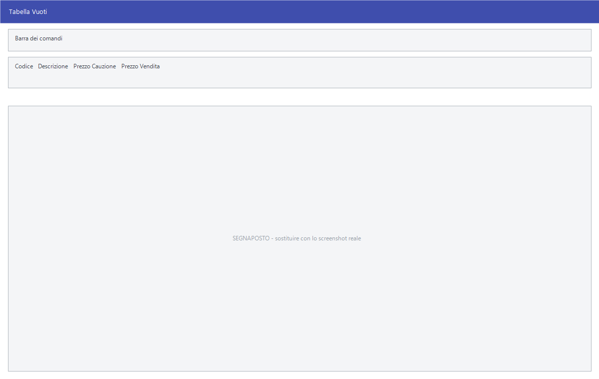

# Tabella vuoti

Chi distribuisce bevande consegna la merce dentro contenitori che tornano
indietro: casse, bottiglie, fusti. Questa tabella li elenca e stabilisce quanto
vale la cauzione di ciascuno.

!!! warning "Solo nella versione Bevande"

    Il ramo **Cauzioni** non è presente in tutte le installazioni: se la
    versione non è quella della distribuzione di bevande, **all'avvio il programma toglie
    l'intero ramo dalla barra dei menu**. Non trovarlo non è un guasto: la
    tua versione non ha questo modulo. Vedi
    [Versioni specifiche](index.md).

!!! info "In sintesi"

    - **Percorso:** Menu ▸ Cauzioni ▸ Tabella Vuoti ▸ Inserimento *(oppure* Modifica *o* Stampa*)*
    - **Scorciatoia:** nessuna; la maschera si apre dal menu
    - **Permessi richiesti:** nessun profilo predefinito; **Inserimento** e **Modifica** si abilitano separatamente per ogni utente da [Archivi ▸ Utenti](../anagrafiche/utenti.md)

---

## A cosa serve

Ogni vuoto ha due prezzi che servono a cose diverse:

- il **prezzo di cauzione** è quello che si addebita alla consegna e si
  restituisce al reso: è un deposito, non un ricavo;
- il **prezzo di vendita** è quello che si applica quando il contenitore non
  torna indietro e viene venduto.

Il resto del ramo **Cauzioni** lavora su questa tabella: il caricamento dei
vuoti, il reso da bolla, l'interrogazione e la stampa della situazione.

!!! info "La cauzione si addebita sul documento di vendita"

    Non c'è un documento a parte: i vuoti si indicano **dentro al
    [documento di vendita](../vendite/documento-di-vendita.md)** — il DDT, la
    bolla o la fattura — in una sezione sua, dove per ogni vuoto si scrive
    **quanti se ne consegnano** e **quanti ne tornano indietro**.

    Il conto lo fa il programma: la cauzione dei consegnati si aggiunge al
    totale, quella dei resi si sottrae, e nei **Totali** del documento il
    risultato compare in **Totale Cauzioni**. Non serve quindi nessuna riga
    di accredito: **il reso si scrive sullo stesso documento** e il netto
    viene da sé.

    L'importo entra sotto l'**aliquota di esenzione** della ditta, perché la
    cauzione non è un corrispettivo: è un deposito che va reso.

!!! note "Quando i vuoti si muovono davvero"

    Come per la merce, non al salvataggio ma **all'emissione del
    documento**. In quel momento il programma scrive il movimento dei vuoti
    e aggiorna il **saldo del cliente** per quel contenitore — consegnati
    meno resi. Annullando il documento il saldo torna indietro.

## Prerequisiti

*Nessuno.*

## La maschera

È una finestra unica, senza schede: la **barra dei comandi** e quattro campi.

## Campi

| Campo | Obbl. | Descrizione | Valori ammessi |
|---|:---:|---|---|
| **Codice** | ● | Identificativo del vuoto. In modifica non si cambia. | Numero |
| **Descrizione** | ● | Il nome del contenitore, come compare negli elenchi e nelle stampe. | Fino a 30 caratteri, convertiti in maiuscolo |
| **Prezzo Cauzione** | | Quanto si addebita alla consegna e si rende al ritorno del vuoto. | Importo |
| **Prezzo Vendita** | | Quanto vale il contenitore se non torna indietro. | Importo |

{: .campi }

## Pulsanti e comandi

| Comando | Scorciatoia | Effetto |
|---|---|---|
| **F2 - Salva** | ++f2++ | Registra il vuoto. In inserimento la maschera si svuota per il successivo. |
| **F3 - Prec.** | ++f3++ | Passa al vuoto precedente. |
| **F4 - Succ.** | ++f4++ | Passa al vuoto successivo. |
| **F5 - Cerca** | ++f5++ | Apre l'elenco dei vuoti, che riporta codice, descrizione e i due prezzi. |
| **F6 - Elimina** | ++f6++ | Cancella il vuoto, previa conferma. |
| **Ricarica** | | Rilegge il vuoto dall'archivio, abbandonando le modifiche non salvate. |

Valgono inoltre:

| Comando | Scorciatoia | Effetto |
|---|---|---|
| Guida | ++f1++ | Apre questa pagina. |
| Chiusura | ++esc++ | Chiude la maschera. |

## Come si fa

### Registrare un tipo di vuoto

1. Apri **Menu ▸ Cauzioni ▸ Tabella Vuoti ▸ Inserimento**.
2. Digita il **Codice** e la **Descrizione**: sono obbligatori.
3. Indica il **Prezzo Cauzione** e, se il contenitore può anche essere venduto,
   il **Prezzo Vendita**.
4. Premi **F2 - Salva**. La maschera si svuota, pronta per il successivo.

### Ritrovare e modificare un vuoto

1. Apri **Menu ▸ Cauzioni ▸ Tabella Vuoti ▸ Modifica**.
2. Premi **F5 - Cerca** e scegli il vuoto dall'elenco, oppure scorri con
   **F3 - Prec.** e **F4 - Succ.**.
3. Correggi i campi e premi **F2 - Salva**.

## Controlli e messaggi

Il codice e la descrizione sono obbligatori: se li lasci vuoti il programma
**emette un segnale acustico** e riporta il cursore sul campo mancante, senza
mostrare alcun messaggio.

| Messaggio | Causa | Cosa fare |
|---|---|---|
| *Confermi la Cancellazione....* | Conferma richiesta da **F6 - Elimina**. | **Sì** elimina. La risposta preimpostata è **No**. |
| *Non è possibile eliminare il record pochè utilizzato in alcuni record del database.* | La voce è già usata da qualche parte. | Non si cancella finché è in uso: il refuso «pochè» è del programma. |
| *In archivio è già presente un record con lo stesso codice.* | Il codice digitato è già di un'altra voce. | Cambia codice. |
| *Il record è stato modificato da un altro nodo della rete.* | Un altro utente ha salvato la stessa voce mentre la modificavi. | Premi **Ricarica**, verifica cosa è cambiato e rifai le tue modifiche. |
| *Il record è stato cancellato da un altro nodo della rete.* | Un altro utente l'ha eliminata mentre la modificavi. | La maschera si chiude: non c'è più nulla da salvare. |

## Note

!!! note "Cambiare il prezzo non tocca i vuoti già consegnati"

    I due prezzi valgono da quando li registri in avanti. Le consegne già
    fatte restano con la cauzione applicata allora: prima di ritoccare un
    prezzo conviene controllare la situazione dei vuoti in giro.

!!! warning "Cambiare il prezzo di cauzione non tocca il passato"

    Il movimento dei vuoti registra **le quantità**, non l'importo: la
    cauzione viene calcolata e scritta **sul documento** nel momento in cui
    lo si emette, e lì resta.

    Modificando il prezzo in questa tabella cambiano quindi **solo i
    documenti da qui in avanti**. Quelli già emessi conservano l'importo con
    cui sono stati fatti, ed è giusto così: al cliente si restituisce quello
    che gli è stato addebitato.

    Il **saldo dei vuoti** del cliente, invece, è un conteggio di pezzi: non
    risente del cambio di prezzo.

## Vedi anche

- [Versioni specifiche](index.md)
- [Documento di vendita](../vendite/documento-di-vendita.md)
