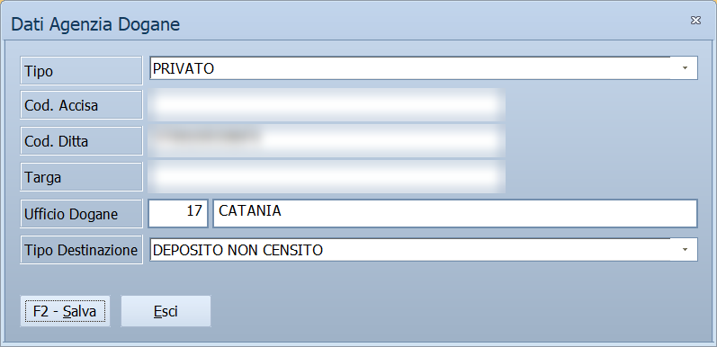

# Dati Agenzia Dogane di una destinazione

In questa finestra si registrano, per una **destinazione diversa** di un cliente,
i dati con cui l'Agenzia delle Dogane riconosce chi riceve il prodotto: che tipo
di soggetto è, i suoi codici, l'ufficio competente e che cosa c'è a quell'indirizzo.
Servono quando si esporta il **DAS** verso una destinazione diversa dalla sede.

!!! info "In sintesi"

    - **Percorso:** Menu ▸ Archivi ▸ Clienti ▸ Inserimento e Modifica, scheda *Destinazioni Diverse*: apri una destinazione in modifica e premi **Dati Agenzia Dogane** nella barra
    - **Scorciatoia:** nessuna
    - **Permessi richiesti:** gli stessi dell'anagrafica clienti
    - **Versione:** solo Energy

---

## A cosa serve

Un cliente può farsi consegnare il prodotto in posti diversi, e ognuno ha i suoi
dati per l'Agenzia: la sede può essere un privato, mentre la destinazione è un
distributore stradale con il suo codice ditta. Esportando il DAS di una consegna
a una destinazione diversa, il programma legge i dati **di quella destinazione**,
non quelli del cliente.

Esempio: il cliente ha un distributore in un altro comune. Nella sua
destinazione scegli **Tipo Destinazione** = *DISTRIBUTORE STRADALE* e scrivi il
**Cod. Ditta** del distributore: i DAS con quella destinazione riportano il
codice giusto.

I dati della sede del cliente sono un'altra finestra, **Dati Trasmissione
Agenzia Dogane**, che si apre dall'[anagrafica clienti](../../anagrafiche/anagrafica-clienti.md)
con **F7 - Altri**.

## Prerequisiti

- La destinazione deve essere già salvata: il pulsante compare solo **in
  modifica**, e solo sulle destinazioni dei clienti — vedi
  [Destinazioni diverse](../../anagrafiche/destinazioni-diverse.md).
- Gli **uffici delle dogane** devono essere in tabella — vedi
  [Le tabelle](tabelle.md#uffici-agenzia-dogane).

## La maschera

Una finestra sola, con sei campi e i due pulsanti in basso. Se la destinazione
ha già i suoi dati, la finestra si apre con quelli e il cursore sta su
**F2 - Salva**; altrimenti si apre vuota, sul campo **Tipo**.

## Campi

| Campo | Obbl. | Descrizione | Valori ammessi |
|---|:---:|---|---|
| **Tipo** | | Che tipo di soggetto riceve il prodotto. Decide quale degli altri campi è obbligatorio (vedi sotto). | PRIVATO, DEPOSITO DI PRODOTTI ASSOGGETTATI AD IMPOSTA (ART.25 DEL TUA), OPERATORE PROFESSIONALE O RAPPRESENTANTE FISCALE, OPERATORE DI PAESI EXTRACOMUNITARI, DEPOSITI AVIO, ATTIVITA' DI BUNKERAGGIO |
| **Cod. Accisa** | ○ | Il codice d'accisa del destinatario. | Fino a 30 caratteri, in maiuscolo |
| **Cod. Ditta** | ○ | Il codice con cui l'Agenzia conosce la ditta destinataria. Esportando il DAS, oltre i 13 caratteri il programma chiede se continuare. | Fino a 30 caratteri, in maiuscolo |
| **Targa** | ○ | La targa del mezzo. | Fino a 30 caratteri, in maiuscolo |
| **Ufficio Dogane** | ○ | Il codice dell'ufficio delle dogane competente; accanto compare la descrizione, che non si modifica. | Un codice della tabella degli uffici |
| **Tipo Destinazione** | | Che cosa c'è a quell'indirizzo. Nel DAS decide quali dati del destinatario vengono trasmessi. | *(vuoto)*, DEPOSITO COMMERCIALE, DISTRIBUTORE STRADALE, DISTRIBUTORE PRIVATO, DEPOSITO PRIVATO/AGRICOLO/INDUSTRIALE CENSITO, UTILIZZATORE NON CENSITO, DEPOSITO NON CENSITO, FORNITURE DI CALORE IN APPALTO |

I campi segnati con ○ sono obbligatori **secondo il Tipo**:

| Tipo | Campo richiesto per salvare |
|---|---|
| PRIVATO | nessuno |
| DEPOSITO DI PRODOTTI ASSOGGETTATI AD IMPOSTA (ART.25 DEL TUA) | **Cod. Ditta** |
| OPERATORE PROFESSIONALE O RAPPRESENTANTE FISCALE | **Cod. Accisa** |
| OPERATORE DI PAESI EXTRACOMUNITARI | **Ufficio Dogane** |
| DEPOSITI AVIO | **Targa** |
| ATTIVITA' DI BUNKERAGGIO | **Targa** |

## Pulsanti e comandi

| Comando | Scorciatoia | Effetto |
|---|---|---|
| **F2 - Salva** | ++f2++ | Registra i dati e chiude la finestra. |
| **Esci** | ++esc++ | Chiude la finestra senza salvare. |

Valgono inoltre:

| Comando | Scorciatoia | Effetto |
|---|---|---|
| Elenco degli uffici | ++f10++, ++space++ o doppio clic su **Ufficio Dogane** | Apre la tabella degli uffici delle dogane per sceglierne uno. |
| Consultazione | ++f11++ | Apre la finestra **Consultazione**. |
| Calcolatrice | ++f12++ | Apre la calcolatrice. |
| Campo successivo | ++enter++ o ++down++ | Sposta il cursore sul campo seguente. |
| Campo precedente | ++up++ | Sposta il cursore sul campo precedente. |

## Come si fa

### Registrare i dati doganali di una destinazione

1. Apri il cliente in **Menu ▸ Archivi ▸ Clienti ▸ Inserimento e Modifica**.
2. Nella scheda *Destinazioni Diverse* apri la destinazione in modifica.
3. Premi **Dati Agenzia Dogane** nella barra.
4. Scegli il **Tipo** del soggetto.
5. Compila il campo che quel tipo richiede — per esempio **Cod. Ditta** per un
   deposito art. 25.
6. In **Ufficio Dogane** premi ++f10++ e scegli l'ufficio dall'elenco.
7. Scegli il **Tipo Destinazione**.
8. Premi **F2 - Salva**: la finestra si chiude e torni alla destinazione.

### Correggere i dati già registrati

1. Apri la destinazione in modifica e premi **Dati Agenzia Dogane**: la
   finestra mostra i dati registrati.
2. Correggi i campi.
3. Premi **F2 - Salva**.

## Controlli e messaggi

| Messaggio | Causa | Cosa fare |
|---|---|---|
| *(nessun messaggio, solo un segnale acustico)* | Manca il campo che il **Tipo** scelto richiede. | Guarda dove si è posizionato il cursore: è il campo da compilare. |

Se in **Ufficio Dogane** scrivi un codice che non è in tabella, il codice si
azzera e la descrizione resta vuota: scegli l'ufficio dall'elenco con ++f10++.

## Note

!!! warning "Il DAS non prende i dati del cliente come riserva"

    Quando il DAS ha una destinazione diversa, i dati doganali vengono letti
    **solo** da questa finestra. Se la destinazione non li ha, il DAS non
    ripiega su quelli della sede: esportandolo compare la domanda *Tipo
    destinazione non impostato sul cliente! Vuoi Continuare?*, anche se sul
    cliente il tipo è compilato. Va compilata la finestra della destinazione.

I dati si registrano con **F2 - Salva** di questa finestra, indipendentemente
dal salvataggio della destinazione: chiudere poi la destinazione con ++esc++ non
li annulla.

## Vedi anche

- [Destinazioni diverse](../../anagrafiche/destinazioni-diverse.md)
- [Anagrafica clienti](../../anagrafiche/anagrafica-clienti.md)
- [Documenti di accompagnamento semplificati](../../vendite/documenti-accompagnatori-semplificati.md)
- [Le tabelle](tabelle.md)
