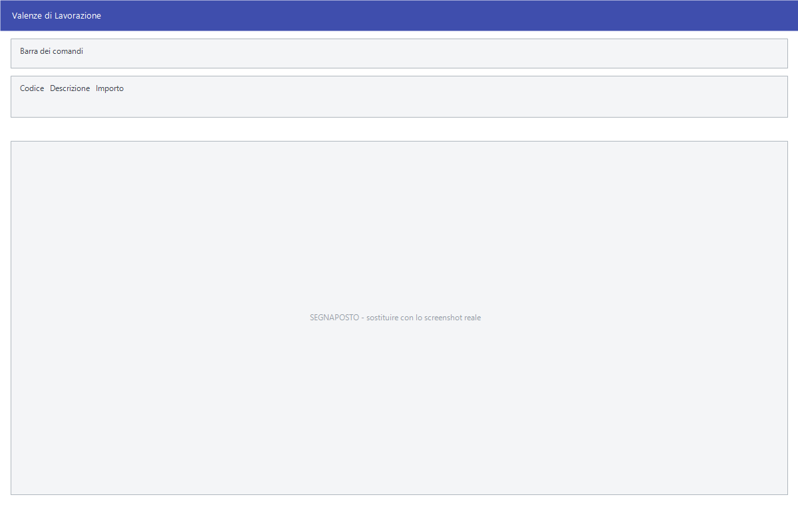

# Valenze di lavorazione

La valenza è il costo di lavorazione: quanto vale, in denaro, la manodopera
associata a un certo tipo di lavoro sull'oro o sull'argento. Questa tabella
raccoglie le valenze e il loro importo.

!!! warning "Solo nella versione Oreficerie"

    Il ramo **Oreficerie** non è presente in tutte le installazioni: se la
    versione non è quella dell'oreficeria, **all'avvio il programma toglie
    l'intero ramo dalla barra dei menu**. Non trovarlo non è un guasto: la
    tua versione non ha questo modulo. Vedi
    [Versioni specifiche](index.md).

!!! info "In sintesi"

    - **Percorso:** Menu ▸ Oreficerie ▸ Inserimento Valenze di Lavorazione *(oppure* Modifica Valenze di Lavorazione*)*
    - **Scorciatoia:** nessuna; la maschera si apre dal menu
    - **Permessi richiesti:** nessun profilo predefinito; **Inserimento** e **Modifica** si abilitano separatamente per ogni utente da [Archivi ▸ Utenti](../anagrafiche/utenti.md)

---

## A cosa serve

Serve a tenere l'elenco delle lavorazioni con il loro costo, per non doverlo
ridigitare ogni volta. L'importo registrato qui è quello che il programma
propone quando la lavorazione viene richiamata.

L'elenco si stampa con **Menu ▸ Oreficerie ▸ Stampa Valenze di Lavorazione**.

<!-- DA VERIFICARE: in quali maschere la valenza viene richiamata, e se l'importo sia proposto o imposto. -->

## Prerequisiti

*Nessuno.*

## La maschera

È una finestra unica, senza schede: la **barra dei comandi** e tre campi.

## Campi

| Campo | Obbl. | Descrizione | Valori ammessi |
|---|:---:|---|---|
| **Codice** | ● | Identificativo della valenza. In modifica non si cambia. | Fino a 3 caratteri, convertiti in maiuscolo |
| **Descrizione** | ● | Il nome della lavorazione, come compare negli elenchi e nelle stampe. | Fino a 30 caratteri, convertiti in maiuscolo |
| **Importo** | | Il costo della lavorazione. | Numero con due decimali |

{: .campi }

## Pulsanti e comandi

| Comando | Scorciatoia | Effetto |
|---|---|---|
| **F2 - Salva** | ++f2++ | Registra la valenza. In inserimento la maschera si svuota per la successiva. |
| **F3 - Prec.** | ++f3++ | Passa alla valenza precedente. |
| **F4 - Succ.** | ++f4++ | Passa alla valenza successiva. |
| **F5 - Cerca** | ++f5++ | Apre l'elenco delle valenze. |
| **F6 - Elimina** | ++f6++ | Cancella la valenza, previa conferma. |
| **Ricarica** | | Rilegge la valenza dall'archivio, abbandonando le modifiche non salvate. |

Valgono inoltre:

| Comando | Scorciatoia | Effetto |
|---|---|---|
| Guida | ++f1++ | Apre questa pagina. |
| Chiusura | ++esc++ | Chiude la maschera. |

## Come si fa

### Registrare una lavorazione

1. Apri **Menu ▸ Oreficerie ▸ Inserimento Valenze di Lavorazione**.
2. Digita il **Codice** e la **Descrizione**: sono obbligatori, e il programma
   li scrive in maiuscolo.
3. Indica l'**Importo** della lavorazione.
4. Premi **F2 - Salva**. La maschera si svuota, pronta per la successiva.

### Ritrovare e modificare una valenza

1. Apri **Menu ▸ Oreficerie ▸ Modifica Valenze di Lavorazione**.
2. Premi **F5 - Cerca** e scegli la valenza dall'elenco, oppure scorri con
   **F3 - Prec.** e **F4 - Succ.**.
3. Correggi i campi e premi **F2 - Salva**.

## Controlli e messaggi

Il codice e la descrizione sono obbligatori: se li lasci vuoti il programma
**emette un segnale acustico** e riporta il cursore sul campo mancante, senza
mostrare alcun messaggio.

<!-- DA VERIFICARE: il testo esatto della conferma di cancellazione e degli altri messaggi di questa maschera. -->

## Note

!!! note "Il codice non si cambia"

    Una volta registrata, la valenza si ritrova per codice: il codice non è
    modificabile in un secondo momento. Per cambiarlo occorre registrare una
    nuova valenza ed eliminare la vecchia.

## Vedi anche

- [Versioni specifiche](index.md)
- [Carico merci](../magazzino/carico-merci.md)
