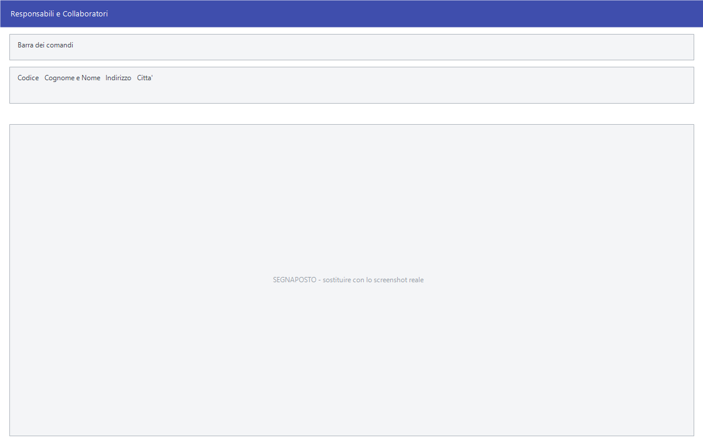

# Responsabili e collaboratori

È l'anagrafica delle persone che lavorano nello studio: chi segue le pratiche
e chi collabora. Ognuna ha un codice, i dati anagrafici e la data in cui il
rapporto è cominciato.

!!! warning "Solo nella versione Studio"

    Il ramo **Procedure Personali** non è presente in tutte le installazioni: se la
    versione non è quella dello studio professionale, **all'avvio il programma toglie
    l'intero ramo dalla barra dei menu**. Non trovarlo non è un guasto: la
    tua versione non ha questo modulo. Vedi
    [Versioni specifiche](index.md).

!!! info "In sintesi"

    - **Percorso:** Menu ▸ Procedure Personali ▸ Responsabili e Collaboratori ▸ Inserimento *(oppure* Modifica*)*
    - **Scorciatoia:** nessuna; la maschera si apre dal menu
    - **Permessi richiesti:** nessun profilo predefinito; **Inserimento** e **Modifica** si abilitano separatamente per ogni utente da [Archivi ▸ Utenti](../anagrafiche/utenti.md)

---

## A cosa serve

Serve ad avere sotto mano chi fa cosa: il collaboratore si richiama dove va
attribuito il lavoro, e i suoi dati anagrafici stanno qui una volta sola
invece che ripetuti su ogni pratica.

!!! info "A che cosa serve il collaboratore"

    È un'**anagrafica di appoggio della versione Studio**: si registrano i
    collaboratori con i loro dati, e li si richiama per codice dove serve
    annotare **chi ha seguito una pratica**.

    L'attribuzione è **un'annotazione**, non un calcolo: il programma non
    ricava dal collaboratore nessun compenso e non lo usa in nessuna
    elaborazione. Serve a ritrovare il lavoro di ciascuno, non a pagarlo.

    Per le provvigioni della rete di vendita la strada è un'altra: gli
    [agenti](../anagrafiche/anagrafica-agenti.md) e le
    [provvigioni](../vendite/provvigioni-agenti.md).

## Prerequisiti

*Nessuno.*

## La maschera

È una finestra unica, senza schede: la **barra dei comandi** e i campi
anagrafici.

## Campi

| Campo | Obbl. | Descrizione | Valori ammessi |
|---|:---:|---|---|
| **Codice** | ● | Identificativo del collaboratore. In modifica non si cambia. | Numero |
| **Cognome e Nome** | ● | Il nominativo, come compare negli elenchi. | Fino a 40 caratteri, convertiti in maiuscolo |
| **Indirizzo** | | La via di residenza. | Fino a 30 caratteri |
| **Città** | | Il comune di residenza. | Fino a 30 caratteri |
| **Prov.** | | La sigla della provincia. | 2 caratteri |
| **Cap** | | Il codice di avviamento postale. | 5 cifre |
| **Codice Fiscale** | | Il codice fiscale, **controllato dal programma**. | 16 caratteri |
| **Partita IVA** | | La partita IVA, **controllata dal programma**. | 11 cifre |
| **Telefono** | | Il telefono fisso. | Fino a 14 caratteri, solo numeri e separatori |
| **Cellulari** | | Due numeri di cellulare. | Fino a 14 caratteri ciascuno |
| **Sesso** | | Il sesso della persona. | `MASCHILE`, `FEMMINILE` |
| **Stato Civile** | | Lo stato civile. | `CONIUGATO`, `CONIUGATA`, `CELIBE`, `NUBILE` |
| **Titolo di Studio** | | Il titolo di studio. | Fino a 30 caratteri |
| **Data di Nascita** | | La data di nascita. | Data |
| **Data Inizio Rapporto** | | Da quando la persona collabora con lo studio. | Data |

{: .campi }

## Pulsanti e comandi

| Comando | Scorciatoia | Effetto |
|---|---|---|
| **F2 - Salva** | ++f2++ | Registra il collaboratore. |
| **F3 - Prec.** | ++f3++ | Passa al collaboratore precedente. |
| **F4 - Succ.** | ++f4++ | Passa al collaboratore successivo. |
| **F5 - Cerca** | ++f5++ | Apre l'elenco, che riporta codice, cognome e nome, indirizzo e città. |
| **F6 - Elimina** | ++f6++ | Cancella il collaboratore, previa conferma. |
| **Ricarica** | | Rilegge il collaboratore dall'archivio, abbandonando le modifiche non salvate. |

Valgono inoltre:

| Comando | Scorciatoia | Effetto |
|---|---|---|
| Guida | ++f1++ | Apre questa pagina. |
| Chiusura | ++esc++ | Chiude la maschera. |

## Come si fa

### Registrare un collaboratore

1. Apri **Menu ▸ Procedure Personali ▸ Responsabili e Collaboratori ▸ Inserimento**.
2. Digita il **Codice** e **Cognome e Nome**: il nominativo è obbligatorio.
3. Compila i recapiti e i dati anagrafici che ti servono.
4. Indica la **Data Inizio Rapporto**.
5. Premi **F2 - Salva**.

### Ritrovare e modificare un collaboratore

1. Apri **Menu ▸ Procedure Personali ▸ Responsabili e Collaboratori ▸ Modifica**.
2. Premi **F5 - Cerca** e scegli dall'elenco, oppure scorri con **F3 - Prec.**
   e **F4 - Succ.**.
3. Correggi i campi e premi **F2 - Salva**.

## Controlli e messaggi

Il codice fiscale e la partita IVA sono verificati dal programma con lo stesso
controllo usato in [anagrafica clienti](../anagrafiche/anagrafica-clienti.md):
se non tornano, il campo non viene accettato.

Se lasci vuoto il nominativo il programma **emette un segnale acustico** e
riporta il cursore sul campo, senza mostrare alcun messaggio.

| Messaggio | Causa | Cosa fare |
|---|---|---|
| *Confermi la Cancellazione....* | Conferma richiesta da **F6 - Elimina**. | **Sì** elimina. La risposta preimpostata è **No**. |
| *Non è possibile eliminare il record poiché utilizzato in alcuni record del database.* | La voce è già usata da qualche parte. | Non si cancella finché è in uso. |
| *In archivio è già presente un record con lo stesso codice.* | Il codice digitato è già di un'altra voce. | Cambia codice. |
| *Il record è stato modificato da un altro nodo della rete.* | Un altro utente ha salvato la stessa voce mentre la modificavi. | Premi **Ricarica**, verifica cosa è cambiato e rifai le tue modifiche. |
| *Il record è stato cancellato da un altro nodo della rete.* | Un altro utente l'ha eliminata mentre la modificavi. | La maschera si chiude: non c'è più nulla da salvare. |

## Vedi anche

- [Versioni specifiche](index.md)
- [Anagrafica clienti](../anagrafiche/anagrafica-clienti.md)
- [Tabelle di classificazione](../magazzino/tabelle-di-classificazione.md)
